# DPR: CÒPIES DE SEGURETAT. CAS PRÀCTIC

| Part 1: Còpia seguretat dels equips clients Windows |
|----------------------------------------|

Creem una màquina virtual Windows 11 amb dos discos, instal·lem el sistema operatiu i un de secundari de 10 GB que servirà per emmagatzemar les còpies de seguretat. Paràmetres, emmagatzematge i creem.


Ara anem a administrar espais d'emmagatzematge, després a crear grup d’emmagatzematge, creem el grup i creem l’espai d'emmagatzematge.


Ara anem a Google Drive, usant un compte que no és d’escola, per fer la simulació. 


Ara instal·lem Duplicati.


Seguidament creem les còpies de seguretat. 


Posem nom a la còpia de seguretat, descripció, contrasenya. 


Cliquem l’opció de File system.


Ara escollim el disc secundari.


Després aquí escollim la carpeta que volem copiar. Home, on tenim documents, downloads…etc


Ara aquí hem de posar quan farem les còpies de seguretat, en aquest cas posem que cada hora es repetiran les còpies de seguretat que aniran al disc secundari. Després continuem i ja per finalitzar en Options, deixem l'opció "Keep all backups” (Conserva totes les còpies), així cada còpia de seguretat es guardarà sense eliminar-ne cap i a baix a la dreta, cliquem Submit (Ens hem de registrar, perquè ens deixi fer el Submit per això, sense registre no deixa, i amb registre sí, cliquem a dalt a la dreta en Click to register). 


Creat, afegirem arxius a les carpetes de l’usuari, especialment a Documents, després farà les còpies corresponents en els horaris/moments corresponents al lloc (el funcionament).


Ara creem l'altre còpia de seguretat, pel Drive. Posem nom a la còpia de seguretat, descripció, contrasenya.


Cliquem l’opció de Drive.


Escollim la carpeta corresponent que volem copiar.


Ara aquí hem de posar quan farem les còpies de seguretat, en aquest cas posem que cada dia a las 18:00 es repetiran les còpies de seguretat que aniran al Drive. Després continuem i ja per finalitzar en Options, deixem l'opció "Keep all backups” (Conserva totes les còpies), així cada còpia de seguretat es guardarà sense eliminar-ne cap i a baix a la dreta, cliquem Submit.


Creat, afegirem arxius a les carpetes de l’usuari, especialment a Documents, després farà les còpies corresponents en els horaris/moments corresponents al lloc (el funcionament).


Fem AuthID a la còpia del Drive perquè funcioni el backup. Per això, en donar-li Start, per exemple, no fa la còpia de seguretat, surt una notificació d'error, on hi ha un enllaç, el copiem, el posem al navegador de Chrome i copiem el text que ens surt, el que surt a la següent imatge, anem a la còpia de seguretat de Drive i en Destination, AuthID el copiem i ja estaria.


Afegirem arxius a les carpetes de l’usuari, especialment a Documents, després farà les còpies corresponents en els horaris/moments corresponents al lloc (el funcionament).


Ara que ja hi han còpies fetes (Versions), esborrem el contingut de Documents i procedim a fer una restauració des del disc secundari i comprovem com podem fer una restauració des de la còpia que teniu emmagatzemada al cloud.


Restauració des del disc secundari. Anem a Restore i escollim l'opció de Còpia de seguretat (disc secundari) i cliquem en Restore. 


Hem de seleccionar els fitxers, seleccionem i confirmem correctament, Continue. 


Original location i Overwrite (en aquest cas). I finalment Submit.


I la restauració estaria completada.


I el contingut ja està correctament restaurat.


Comprovem com podem fer una restauració des de la còpia que teniu emmagatzemada al cloud. Fent el mateix procediment. Ara que ja hi han còpies fetes (Versions), esborrem el contingut de Documents i comprovem com podem fer una restauració des de la còpia que teniu emmagatzemada al cloud.


Restauració des de la còpia que teniu emmagatzemada al cloud. Anem a Restore i escollim l'opció de Còpia de seguretat Drive i cliquem en Restore. 


Hem de seleccionar els fitxers, seleccionem i confirmem correctament, Continue. 


Original location i Overwrite (en aquest cas). I finalment Submit.


I la restauració estaria completada.


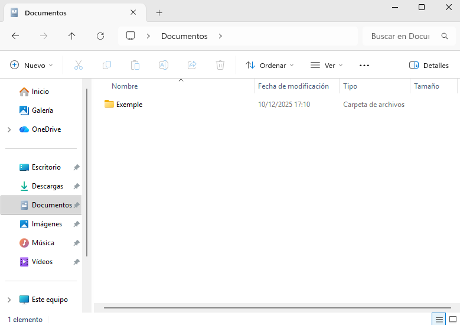

Pot tenir horari diferent perquè la màquina canvia la hora tot el temps, sinó seria per el moment de creació de la carpeta i els arxius.

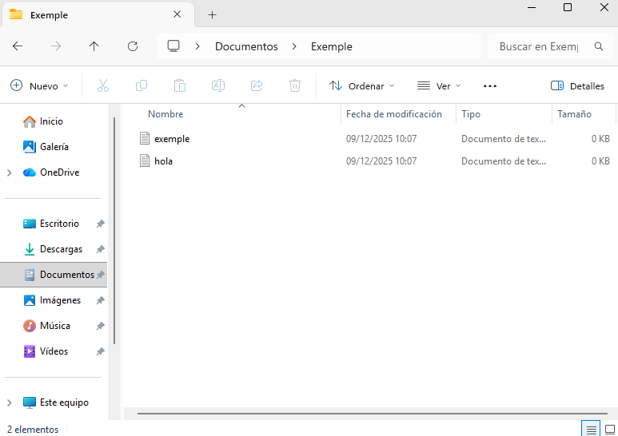

Si ens fixem, tant al disc secundari com al nostre Google Drive surten els arxius Duplicati, són les còpies de seguretat encriptades que Duplicati ha creat. Entrem al nostre Google Drive per exemple i ho veiem.


Disc secundari.


| Part 2: Còpia seguretat servidor Linux |
|----------------------------------------|

Faig servir una màquina virtual amb un Ubuntu Server instal·lat i li hauré d'afegir un segon disc de 10 GB que simularà una unitat auxiliar.


Inicialitzo i formatego en format xfs. Com simula una unitat externa, es muntarà manualment a /media/backup (primer cal crear la carpeta).

```
sudo mkdir /media/backup
```

```
ls -l /media/
```


Ara després instal·lem fdisk, per donar format al disk.

```
sudo apt install fdisk
```

```
sudo fdisk -l
```


Ara instal·lem lvm2.

```
sudo apt install lvm2
```

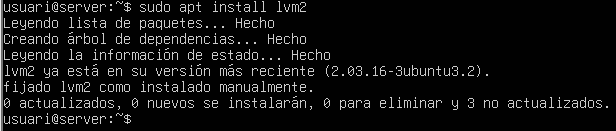

Creem volum al disk.

```
sudo pvcreate /dev/sdb
```

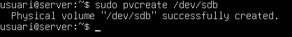

Formategem. 

```
sudo mkfs.xfs -f /dev/sdb
```

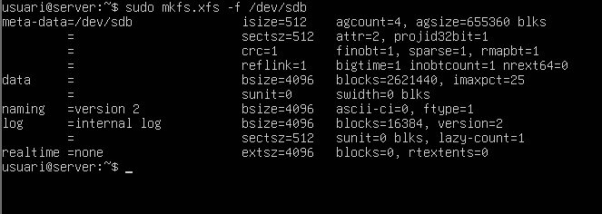

Després muntem el disc a la carpeta /media/backup.

```
sudo mount /dev/sdb /media/backup
```

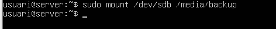

Instal·lem Duplicity. 

```
sudo apt install duplicity -y
```


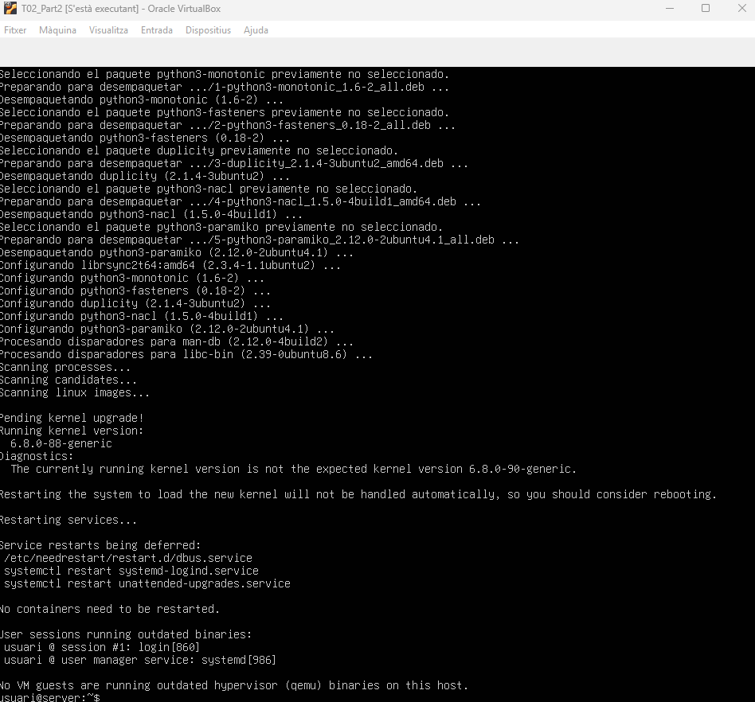

Creem un parell d’usuaris més al sistema de manera que tinguin carpeta personal i creem 4 arxius de 10 MB a la carpeta home del nostre usuari.

```
sudo useradd -m -s /bin/bash usuari01
```

```
sudo useradd -m -s /bin/bash usuari02
```

```
sudo fallocate -l 10MB arx01
```

```
sudo fallocate -l 10MB arx02
```

```
sudo fallocate -l 10MB arx03
```

```
sudo fallocate -l 10MB arx04
```


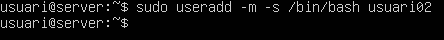


Ara fem una còpia de seguretat de la carpeta /home.

```
sudo duplicity full /home file:///media/backup/
```

```
ls /media/backup/
```

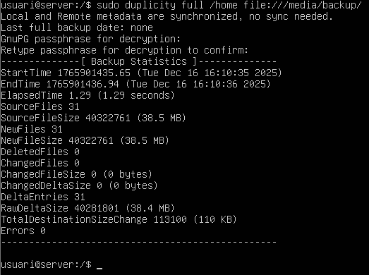

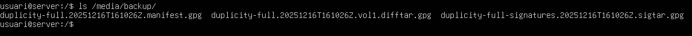

Esborrem els arxius i fem un restore per comprovar com es recuperen els arxius.

```
sudo rm arx01
```

```
sudo rm arx02
```

```
sudo rm arx03
```

```
sudo rm arx04
```

```
ls
```

```
sudo duplicity restore --force file:///media/backup/ /home
```

```
ls
```


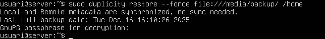


Afegim un nou arxiu de 4 MB i fem una nova còpia. Observem com ara ha fet una còpia incremental.

```
fallocate -l 4MB arx05
```

```
sudo duplicity /home file:///media/backup/
```


Desmuntem la unitat de backup.

```
umount /media/backup
```


Ara passaràs a automatitzar el procés de les còpies utilitzant uns scripts bàsics i el programador de tasques (cron). Un aspecte molt important a nivell de seguretat, és que la unitat de backup ha d’estar per defecte, desmuntada. De manera que el primer pas sempre serà muntar la unitat i el darrer desmuntar-la, un cop s’ha fet la còpia.

Crea un script anomenat fullbackup.sh que realitzi la còpia completa de la carpeta /home i l’emmagatzemi al volum muntat. Usa la variable d’entorn PASSPHRASE (per donar valor a una variable d’entorn cal afegir a l’script una línia amb export PASSPHRASE=contrasenya) per no haver d’escriure la passphrase en el moment de l’execució. Recorda de donar permisos d’execució a l’script.

Creem l'arxiu, entrem i creem l'script.

```
sudo mkdir fullbackup.sh
```

```
sudo nano /fullbackup.sh
```

```
!/bin/bash
export PASSPHRASE="usuariusuari1234"
mount /dev/sdb /media/backup
duplicity full /home file:///media/backup/homebackup
umount /media/backup
```

![Ara passaràs a automatitzar el procés de les còpies utilitzant uns scripts bàsics i el programador de tasques (cron). Un aspecte molt important a nivell de seguretat, és que la unitat de backup ha d’estar per defecte, desmuntada. De manera que el primer pas sempre serà muntar la unitat i el darrer desmuntar-la, un cop s’ha fet la còpia.
Crea un script anomenat fullbackup.sh que realitzi la còpia completa de la carpeta /home i l’emmagatzemi al volum muntat. Usa la variable d’entorn PASSPHRASE (per donar valor a una variable d’entorn cal afegir a l’script una línia amb export PASSPHRASE=contrasenya) per no haver d’escriure la passphrase en el moment de l’execució. Recorda de donar permisos d’execució a l’script.
Creem l'arxiu, entrem i creem l'script.](Img/Imatge64.png)

![Ara passaràs a automatitzar el procés de les còpies utilitzant uns scripts bàsics i el programador de tasques (cron). Un aspecte molt important a nivell de seguretat, és que la unitat de backup ha d’estar per defecte, desmuntada. De manera que el primer pas sempre serà muntar la unitat i el darrer desmuntar-la, un cop s’ha fet la còpia.
Crea un script anomenat fullbackup.sh que realitzi la còpia completa de la carpeta /home i l’emmagatzemi al volum muntat. Usa la variable d’entorn PASSPHRASE (per donar valor a una variable d’entorn cal afegir a l’script una línia amb export PASSPHRASE=contrasenya) per no haver d’escriure la passphrase en el moment de l’execució. Recorda de donar permisos d’execució a l’script.
Creem l'arxiu, entrem i creem l'script.](Img/Imatge65.png)

![Ara passaràs a automatitzar el procés de les còpies utilitzant uns scripts bàsics i el programador de tasques (cron). Un aspecte molt important a nivell de seguretat, és que la unitat de backup ha d’estar per defecte, desmuntada. De manera que el primer pas sempre serà muntar la unitat i el darrer desmuntar-la, un cop s’ha fet la còpia.
Crea un script anomenat fullbackup.sh que realitzi la còpia completa de la carpeta /home i l’emmagatzemi al volum muntat. Usa la variable d’entorn PASSPHRASE (per donar valor a una variable d’entorn cal afegir a l’script una línia amb export PASSPHRASE=contrasenya) per no haver d’escriure la passphrase en el moment de l’execució. Recorda de donar permisos d’execució a l’script.
Creem l'arxiu, entrem i creem l'script.](Img/Imatge66.png)

Canviem els permisos, posem la següent comanda per canviar els permisos de manera que pugui executar.

```
sudo chmod +x fullbackup.sh
```

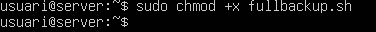

Programem al cron com a root l’execució de l’script els diumenges a les 23:00.

```
crontab -e
```


Posem aquest text:

```
0 23 * * 0 /home/usuari/fullbackup.sh
```

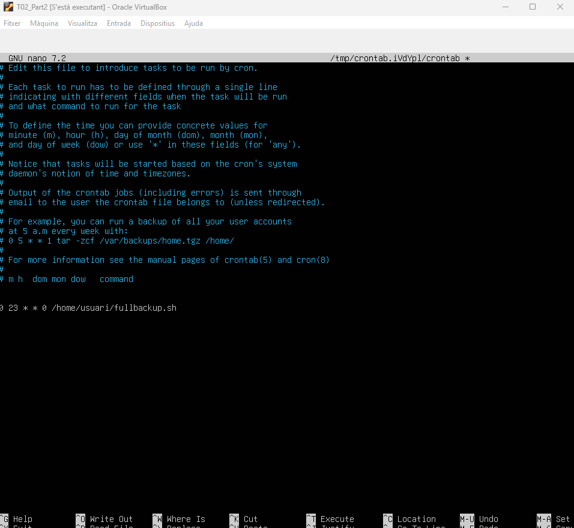

Creem un segon script anomenat incrementalbackup.sh que realitzi còpies incrementals de la mateixa carpeta que abans. Hem de fixar el valor de la variable PASSPHRASE igual que al punt 5 i donar permisos d’execució a l’script.

Creem l'arxiu, entrem i creem l'script.

```
sudo mkdir incrementalbackup.sh
```

```
sudo nano /incrementalbackup.sh
```

```
!/bin/bash
export PASSPHRASE="usuariusuari1234"
mount /dev/sdb /media/backup
duplicity incremental /home file:///media/backup/homebackup
umount /media/backup
```


Canviem els permisos, posem la següent comanda per canviar els permisos de manera que pugui executar.

```
sudo chmod +x incrementalbackup.sh 
```


Programem al cron com a root l’execució de l’script a les 23:00 dels dilluns als diumenges.

```
crontab -e
```


Posem aquest text:

```
0 23 * * 0 /home/usuari/fullbackup.sh
0 23 * * 1-6 /home/usuari/incremental.sh
```


Desem canvis.


[Anar a l'enunciat](../Tasca02/README.md)  
[Anar a la pàgina inicial](../README.md)
