# DPR: CÒPIES DE SEGURETAT. CAS PRÀCTIC

Creem una màquina virtual Windows 11 amb dos discos, instal·lem el sistema operatiu i un de secundari de 10 GB que servirà per emmagatzemar les còpies de seguretat. Paràmetres, emmagatzematge i creem.

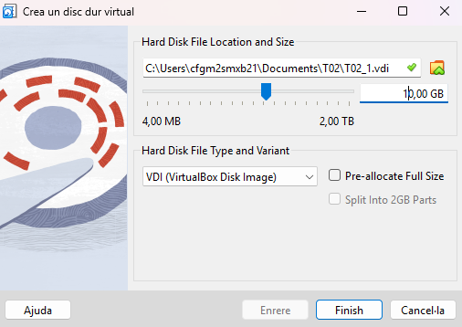

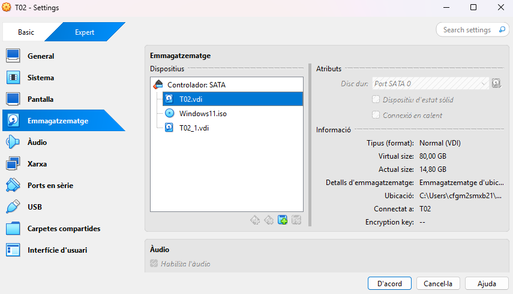

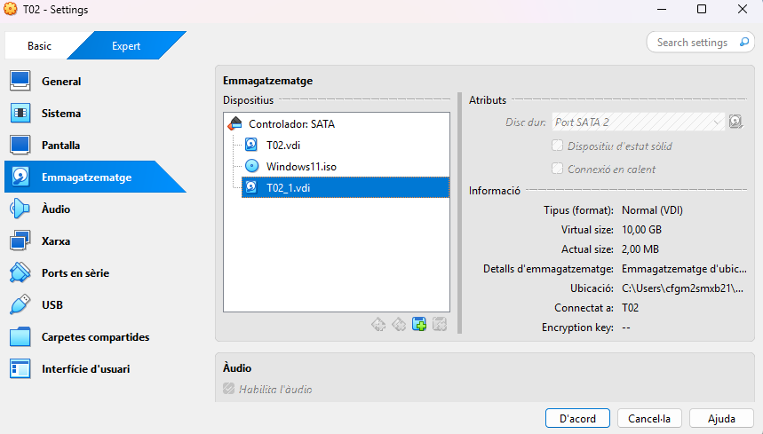

Ara anem a administrar espais d'emmagatzematge, després a crear grup d’emmagatzematge, creem el grup i creem l’espai d'emmagatzematge.

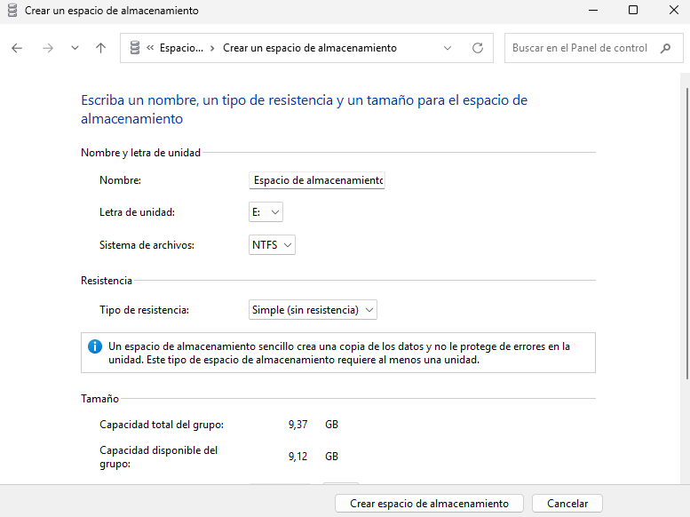

Ara anem a Google Drive, usant un compte que no és d’escola, per fer la simulació. 

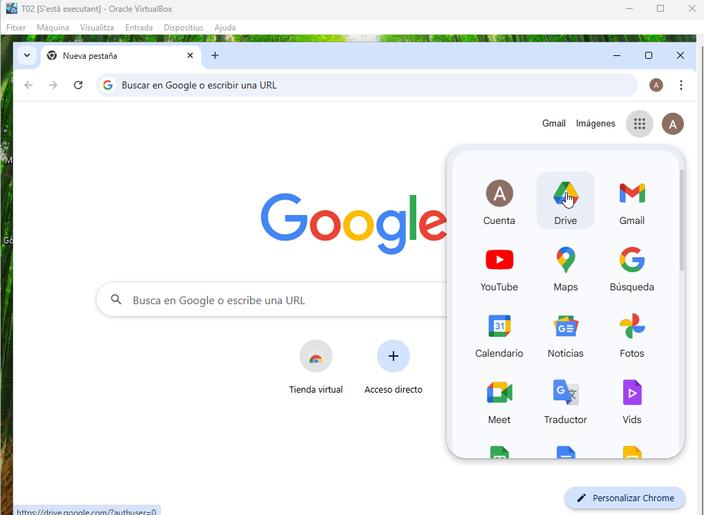

Ara instal·lem Duplicati.

Seguidament creem les còpies de seguretat. 

Posem nom a la còpia de seguretat, descripció, contrasenya. 

Cliquem l’opció de File system.

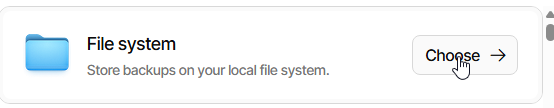

Ara escollim el disc secundari.

Després aquí escollim la carpeta que volem copiar. Home, on tenim documents, downloads…etc

Ara aquí hem de posar quan farem les còpies de seguretat, en aquest cas posem que cada hora es repetiran les còpies de seguretat que aniran al disc secundari. Després continuem i ja per finalitzar en Options, deixem l'opció "Keep all backups” (Conserva totes les còpies), així cada còpia de seguretat es guardarà sense eliminar-ne cap i a baix a la dreta, cliquem Submit (Ens hem de registrar, perquè ens deixi fer el Submit per això, sense registre no deixa, i amb registre sí, cliquem a dalt a la dreta en Click to register). 

Creat, afegirem arxius a les carpetes de l’usuari, especialment a Documents, després farà les còpies corresponents en els horaris/moments corresponents al lloc (el funcionament).

Ara creem l'altre còpia de seguretat, pel Drive. Posem nom a la còpia de seguretat, descripció, contrasenya.

Cliquem l’opció de Drive.

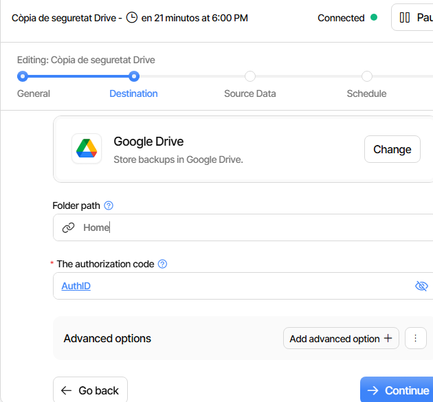

Aquí escollim la carpeta que volem copiar. Home.

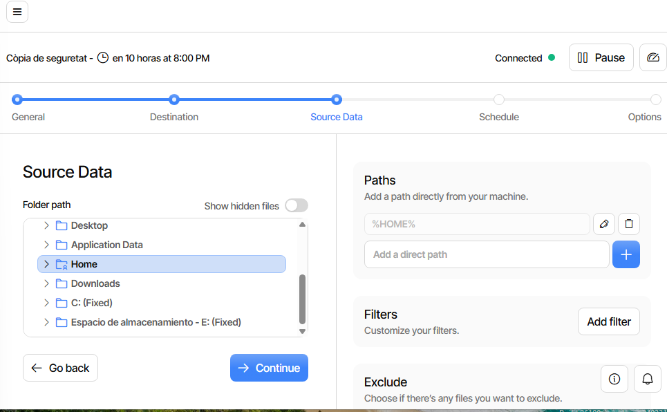

Ara aquí hem de posar quan farem les còpies de seguretat, en aquest cas posem que cada dia a las 18:00 es repetiran les còpies de seguretat que aniran al Drive. Després continuem i ja per finalitzar en Options, deixem l'opció "Keep all backups” (Conserva totes les còpies), així cada còpia de seguretat es guardarà sense eliminar-ne cap i a baix a la dreta, cliquem Submit.

Creat, afegirem arxius a les carpetes de l’usuari, especialment a Documents, després farà les còpies corresponents en els horaris/moments corresponents al lloc (el funcionament).

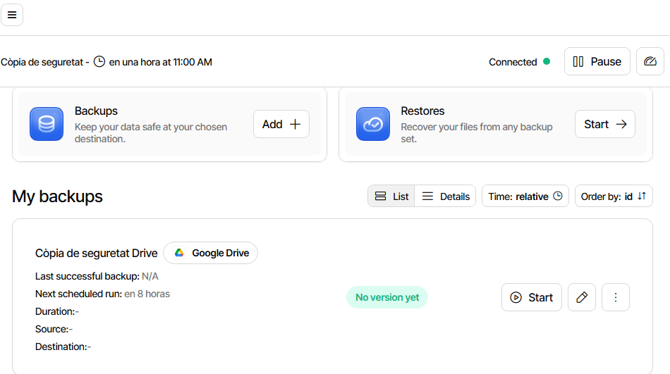

Fem AuthID a la còpia del Drive perquè funcioni. 

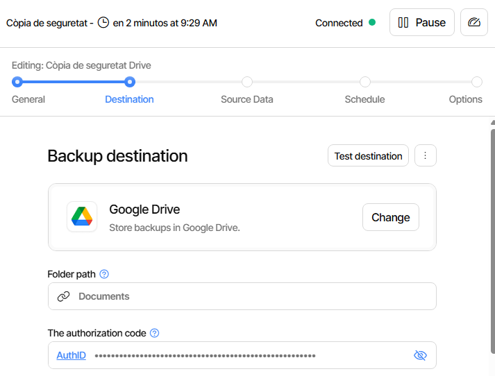

Afegirem arxius a les carpetes de l’usuari, especialment a Documents, després farà les còpies corresponents en els horaris/moments corresponents al lloc (el funcionament).

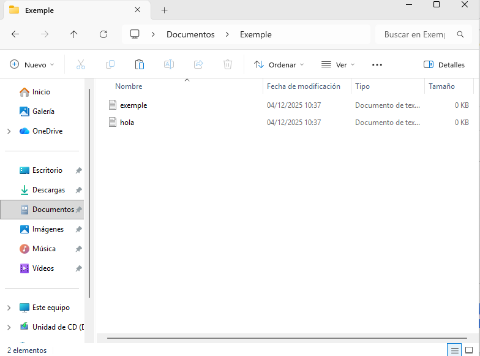

Ara que ja hi han còpies fetes, esborrem el contingut de Documents i procediu a fer una restauració des del disc secundari i comprovem com podem fer una restauració des de la còpia que teniu emmagatzemada al cloud.

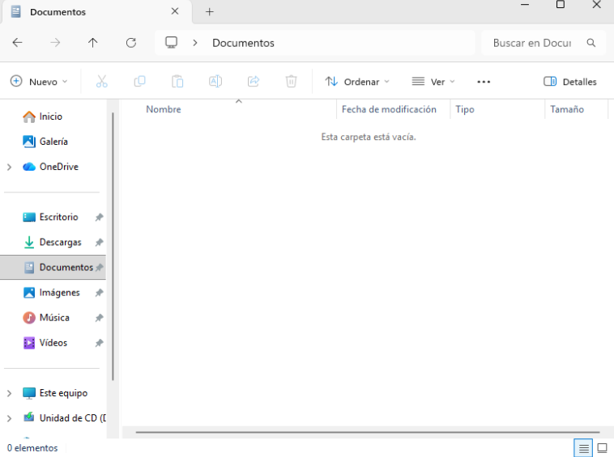

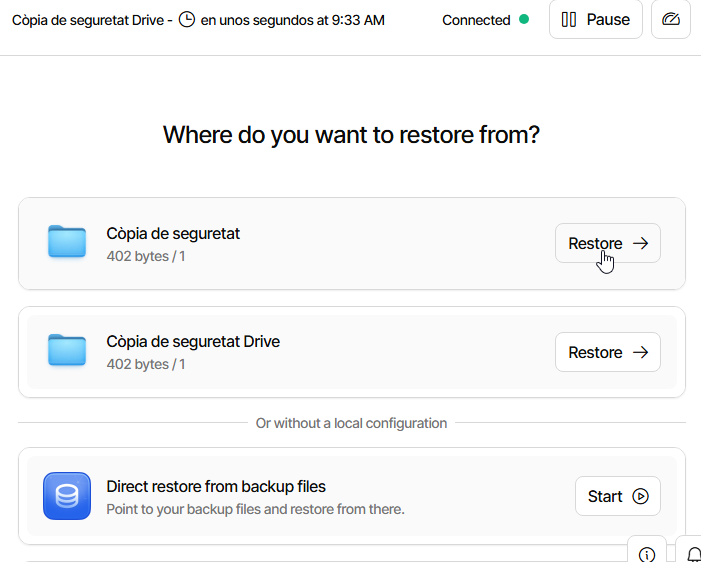

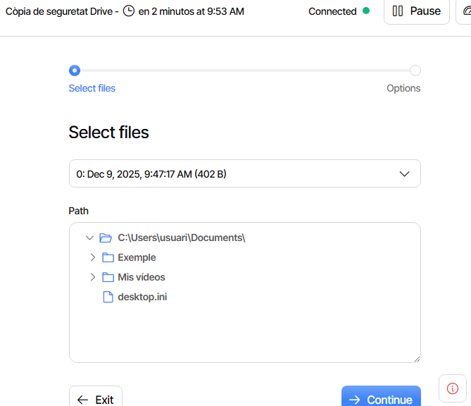

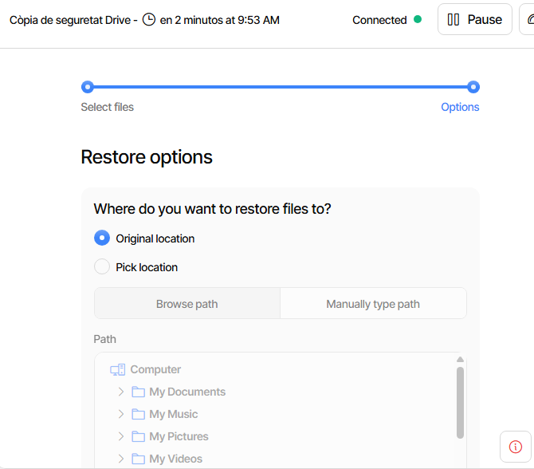

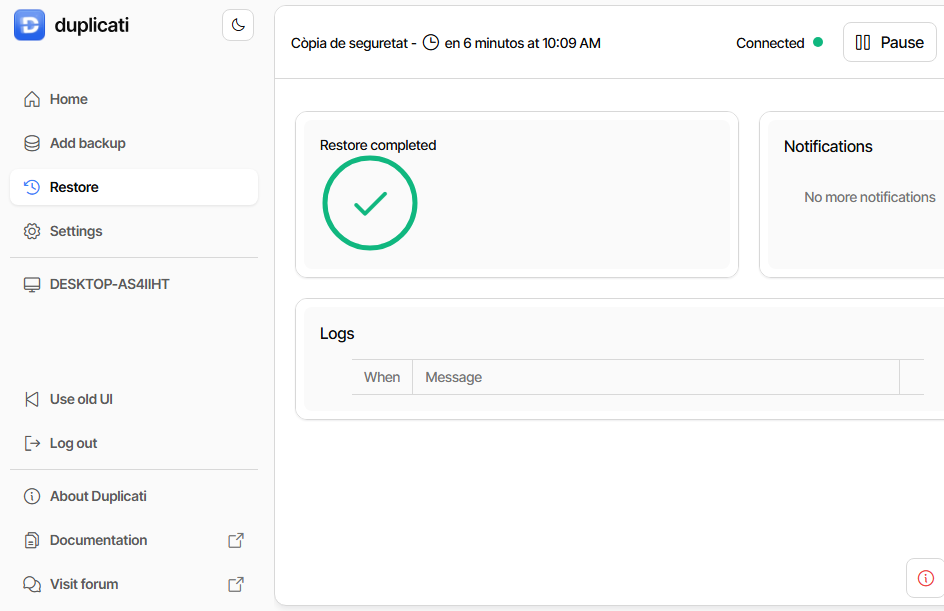

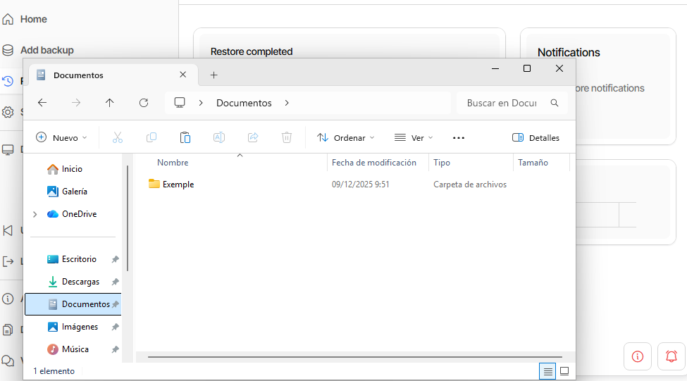

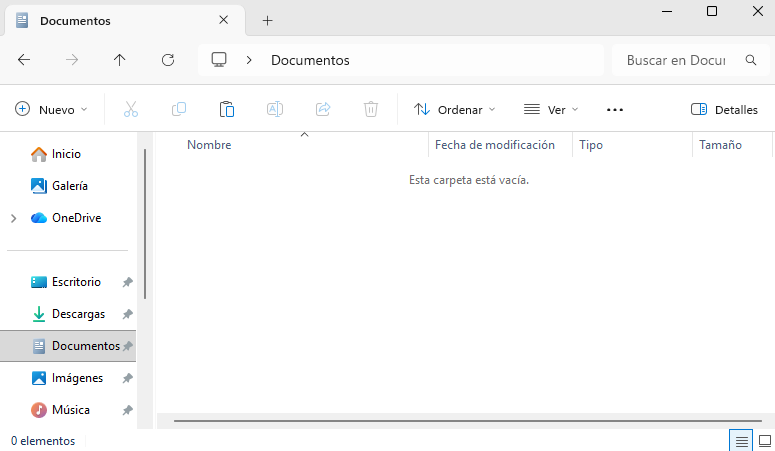

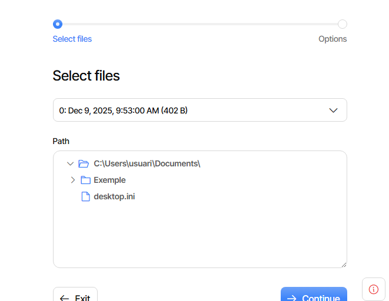

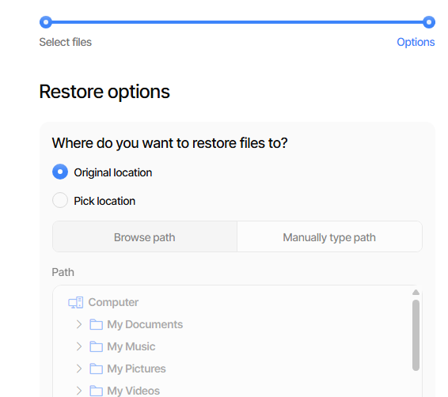

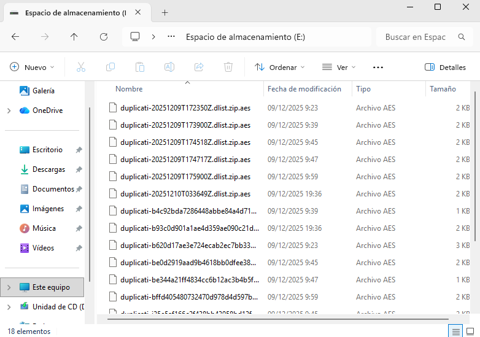

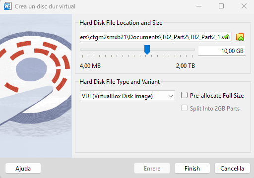

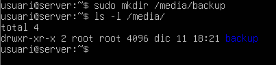

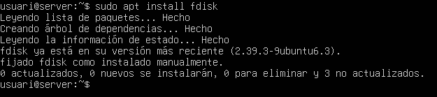

[Anar a l'enunciat](../Tasca02/README.md)  
[Anar a la pàgina inicial](../README.md)
