# Accés Remot. Connexió via SSH

| Pràctica SSH |
|----------------------------------------|

A la màquina d'Ubuntu Server i Windows, en xarxa, el primer adaptador el posem/deixem en NAT i el segon en Adaptador de només l’amfitrió.


Entrem i el primer que fem és editar el netplan.

```
sudo nano /etc/netplan/50-cloud-init.yaml
```


Apliquem canvis.

```
sudo netplan apply
```


**Instal·lem el ssh amb la següent comanda:**

```
sudo apt install ssh
```


Després l’habilitem, reiniciem i comprovem l’estat.
```
sudo systemctl enable ssh
```
```
sudo systemctl restart ssh
```
```
sudo systemctl status ssh
```


Ara fem: ip a, per veure la ip del adaptador de només amfitrió.
```
ip a
```


Ara anem a la màquina Windows per comprovar la connexió. Quan ens demani permisos diem que sí i posem la contrasenya.

```
ssh usuari@IP-del-servidor
```


Verifiquem el hostname:
```
hostname
```


Anem a l'Ubuntu, habilitem l’usuari root, fem sudo passwd root i li posem una contrasenya (usuari).
```
sudo passwd root
```


Seguidament entrem al següent arxiu, anem al final i afegim la següent línia. 

```
sudo nano /etc/ssh/sshd_config
```


Fem login de manera local amb l’usuari root.

```
su - root
```


Ara anem a Windows, fem ssh amb l’usuari root i veurem com ens denega l’accés.

```
ssh root@IP-del-servidor
```


Ara posem la següent comanda per generar alguns codis RSA.

```
ssh-keygen -t rsa
```


Ara seguidament posem la comanda; ls .\.ssh\, i mirarem dins del directori de la carpeta ssh els arxius que hi han creats, copiarem a la màquina ubuntu el que acaba en .pub i el copiarem amb la comanda scp.

```
ls .\.ssh\
```


```
scp .\.ssh\id_rsa.pub usuari@IP-del-servidor:/home/usuari
```


Anem a ubuntu i creem el següent arxiu, ha d’estar dins de la carpeta ssh aleshores el crearem amb la següent comanda: 

```
touch .ssh/authorized_keys
```


Seguidament copiem la clau id_rsa.pub dins del arxiu que hem creat abans. 

```
cat id_rsa.pub >> .ssh/authorized_keys_
```


Ara anem a Windows i posem la següent comanda per fer la comprovació de que ens podem connectar a la màquina ubuntu sense que ens demani contrasenya.

```
ssh usuari@IP-del-servidor
```


Ara anirem a configuració, sistema, anem a características opcionals i cliquem a veure característiques (el que volem és poder tenir el servidor OpenSSH). 

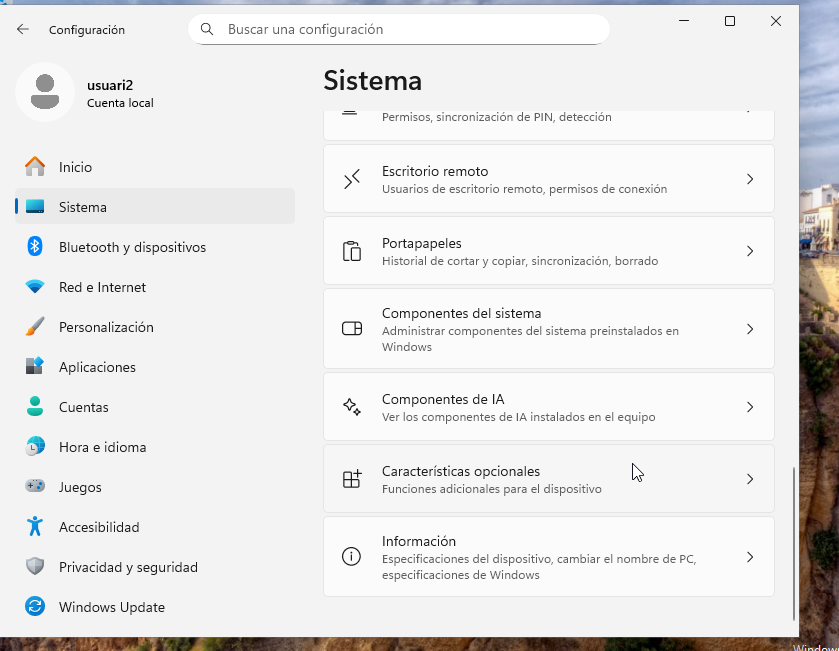

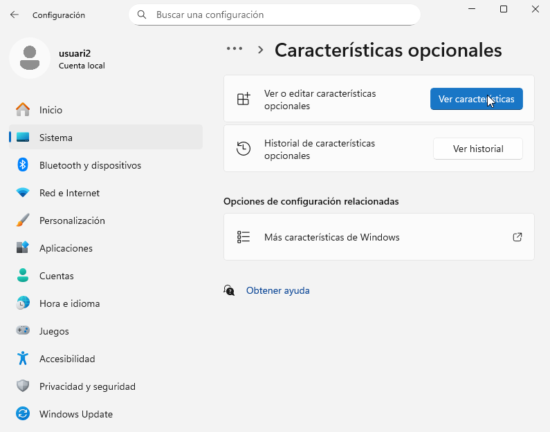


Cliquem a veure les característiques disponibles.

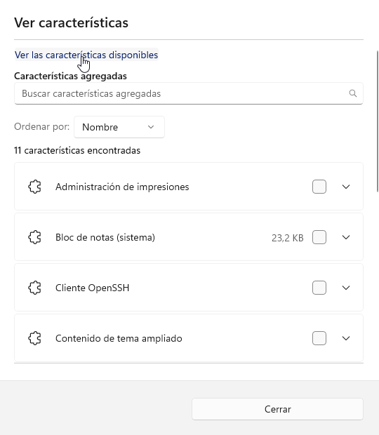

En característiques disponibles buscarem OpenSSH, marcarem la casella i l’agregarem.

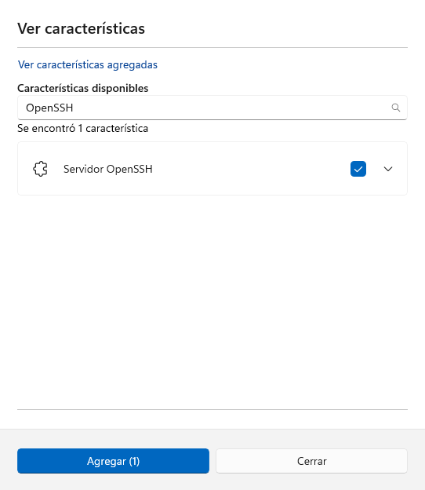

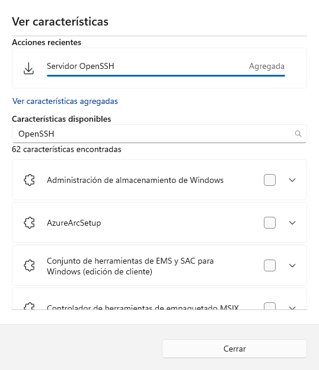

Després desactivem el Firewall, per això anem Firewall i protecció de xarxa i després a Red pública i desactivem. Desactivem el tallafoc per permetre la connexió SSH entre les màquines sense que Windows bloquegi el tràfic.


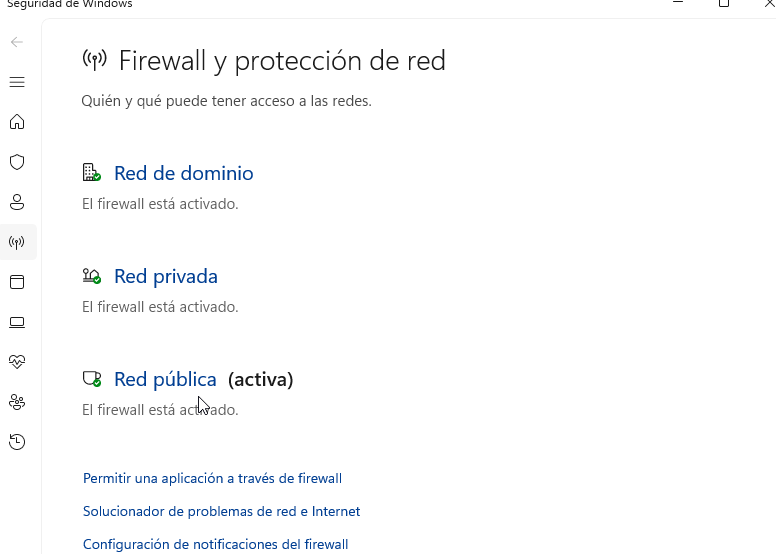


Ara executem el powershell com administrador.

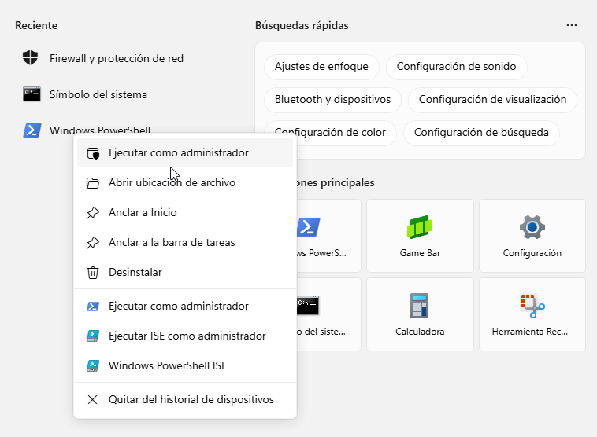

I iniciem en servei de server SSH.

```
Start-Service sshd
```

 

Posem aquesta comanda per què cada vegada que iniciem la màquina s’activi el servei.

```
Set-Service -Name sshd -StartupType "Automatic"
```


Posem; ipconfig, per veure la IP de l’adaptador de només amfitrió i després amb aquella IP ens puguem connectar des de l'Ubuntu.

```
ipconfig
```

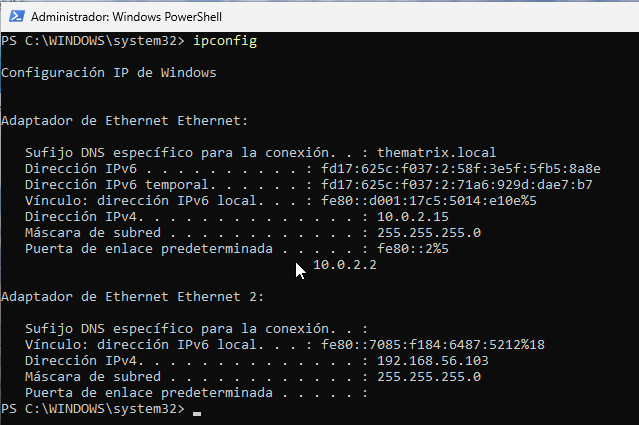

Ara, des de la màquina Ubuntu, fem un ping per comprovar que es poden veure les dues màquines i ens connectem a la màquina Windows amb la IP de la interfície de només amfitrió de la màquina Windows.

```
ping IP-local-de-Windows
```


```
ssh usuari@IP-local-de-Windows
```


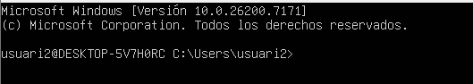

Seguidament la creació d’un túnel SSH (Proxy SOCKS), amb la següent comanda: 

```
ssh -D 9876 usuari@IP-del-servidor
```

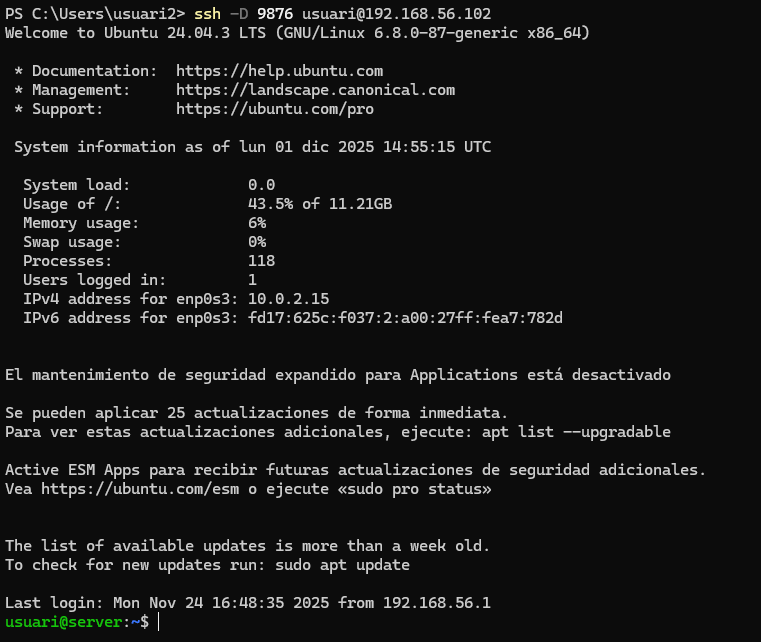 

Ara fem la configuració del Proxy a Windows, primerament anem a panell de control. 

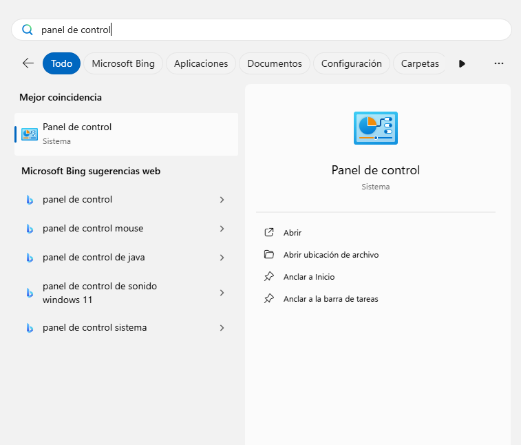 

Després a Xarxa i Internet.

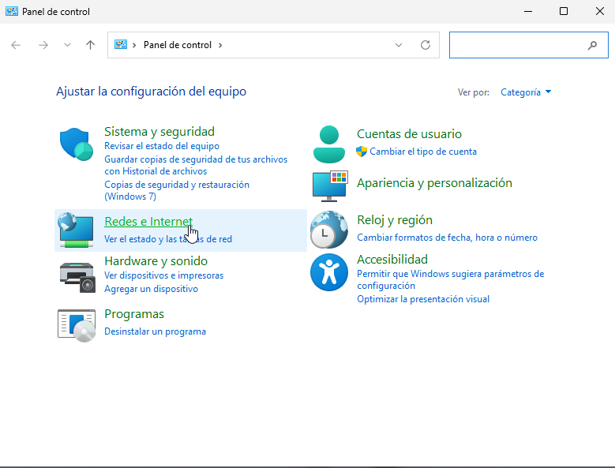 

Ara a Opcions d’Internet.

 

Anem a connexions i configuració de LAN. 

 

Opcions avançades (Deixem marca l'opció de: Usar un servidor proxy para la LAN).

 

Posem en Socks IP local i port 9876.

 

I després instal·lem Wireshark i fem la validació del túnel amb Wireshark.

 


[Anar a l'enunciat](../Tasca01/README.md)  
[Anar a la pàgina inicial](../README.md)
