# Accés Remot. Connexió via SSH

| Pràctica SSH |
|----------------------------------------|

A la màquina de ubuntu server, en xarxa, el primer adaptador el posem/deixem en NAT i el segon en Adaptador de només l’amfitrió.

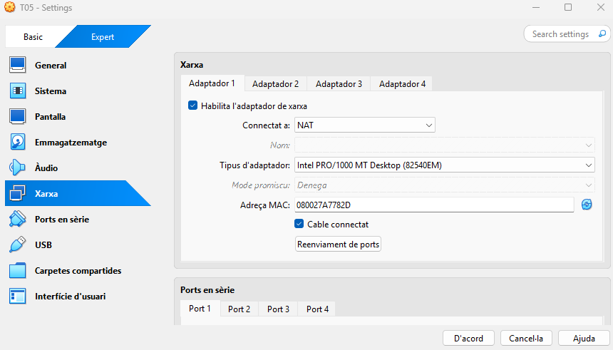

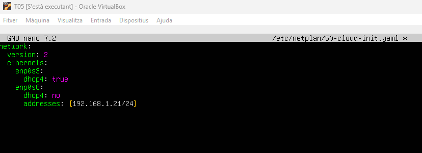

Entrem i el primer que fem és editar el netplan.


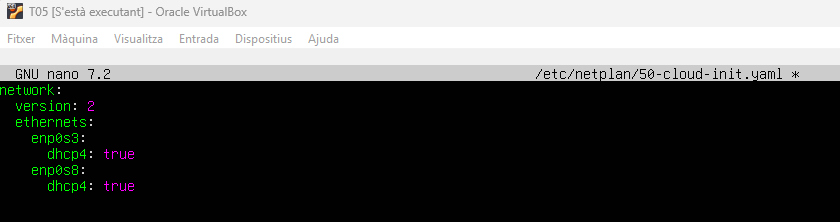


**Instal·lem el ssh amb la següent comanda:**

```
sudo apt install ssh
```


Després l’habilitem, reiniciem i comprovem l’estat.
```
sudo systemctl enable ssh
```
```
sudo systemctl restart ssh
```
```
sudo systemctl status ssh
```


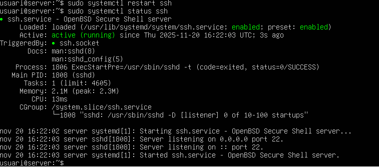

Ara fem: ip a, per veure la ip del adaptador de només amfitrió.
```
ip a
```


Ara anem a la màquina Windows per comprovar la connexió. Quan ens demani permisos diem que sí i posem la contrasenya.


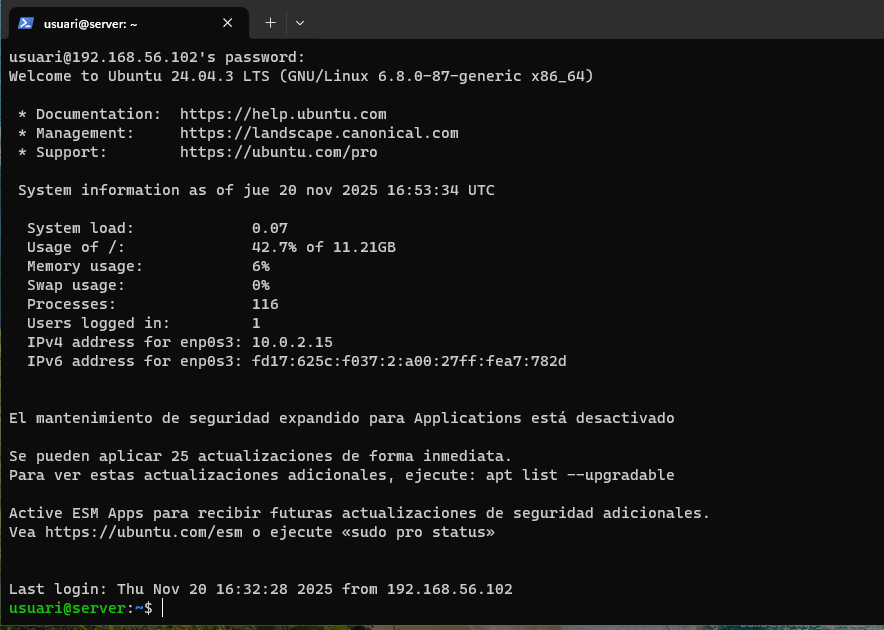


Habilitem l’usuari root a l’Ubuntu, fem sudo passwd root i li posem una contrasenya (usuari).
```
sudo passwd root
```

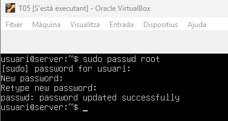

Ara mostrem la configuració relativa als usuaris a l’arxiu sshd_config: usuarios permesos, engabiat, etc. Habilitem només a un usuari per accedir remotament i comprovem com altres no hi poden conectar. 
Entrem al següent arxiu, anem al final i afegim la següent línia. 


Fem login de manera local amb l’usuari root.
```
su - root
```

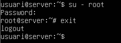

Ara anem a Windows, fem ssh amb l’usuari root i veurem com ens denega l’accés.

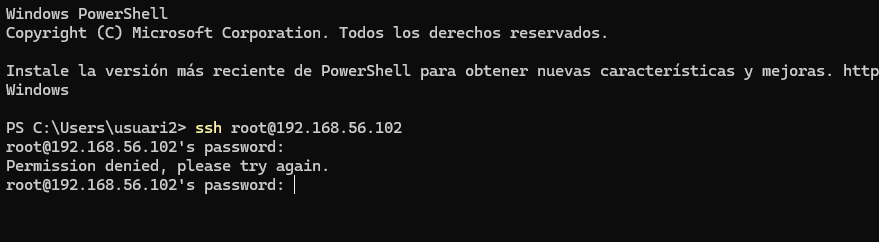

Ara posem la següent comanda per generar alguns codis RSA.

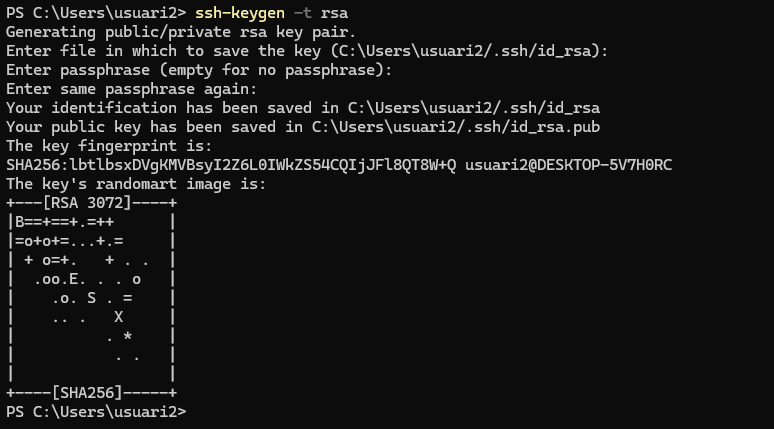

Ara seguidament posem la comanda; ls.\ssh\, i mirarem dins del directori de la carpeta ssh els arxius que hi han creats, copiarem a la màquina ubuntu el que acaba en .pub i el copiarem amb la comanda scp.

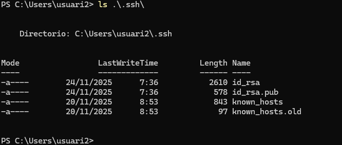

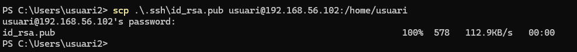

Anem a ubuntu i creem el següent arxiu, ha d’estar dins de la carpeta ssh aleshores el crearem amb la següent comanda:  


Seguidament copiem la clau id_rsa.pub dins del arxiu que hem creat abans. 


[Anar a l'enunciat](../Tasca01/README.md)  
[Anar a la pàgina inicial](../README.md)
