# ACCÉS REMOT. ESCRIPTORI REMOT (RDP)

Primer de tot posem Xarxa NAT al Adaptador 1 a les dues màquines virtuals perquè es puguin veure.

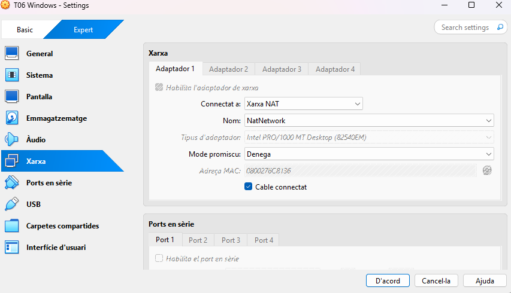

Primer anem a Windows a configurar-lo perquè accepti connexions, anem a Configuració, Sistema.

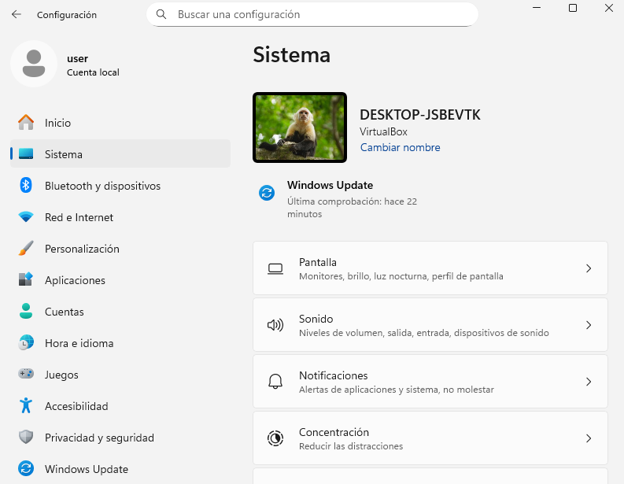

Ara busquem Escriptori Remot, activem l'opció Escriptori Remot.


També marquem la casella.

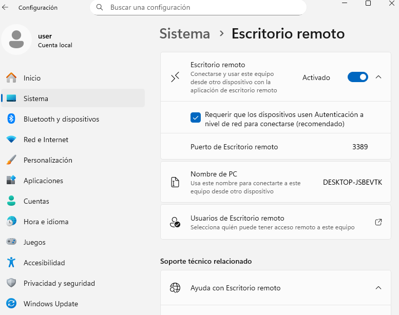

Cliquem on posa Usuaris d'Escriptori remot, ara afegir.


Posem el nom de PC i el nom; user en aquest cas.

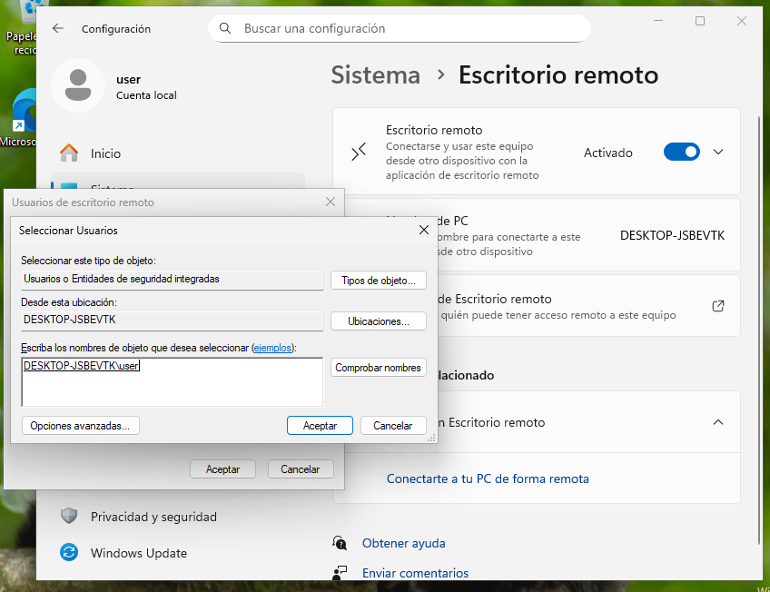

Acceptem i ja hem fet la configuració Windows.


Ara fem la configuració Zorin. Per això anem a Configuració, després a Sistema i Escriptori Remot.

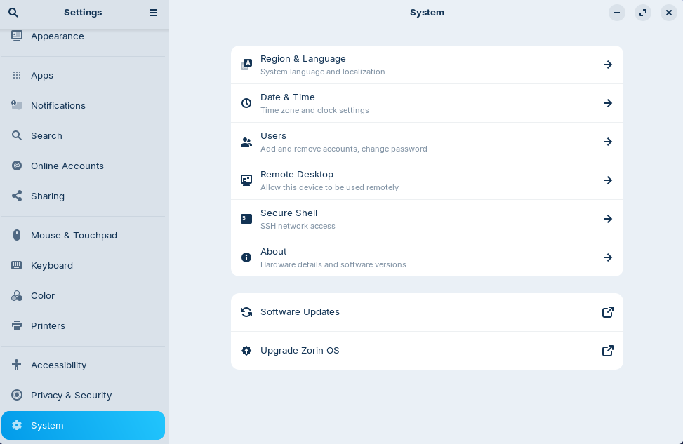

I posem en “on” tant Compartició d’Escriptori com Control Remot.


Ara entrem a Remmina.

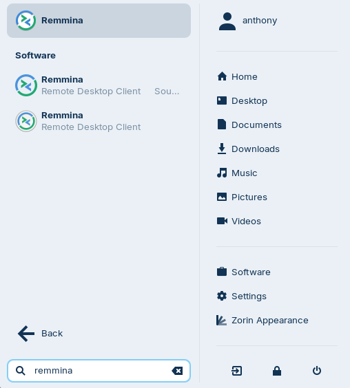

Posem l’IP del Windows i donem Enter.

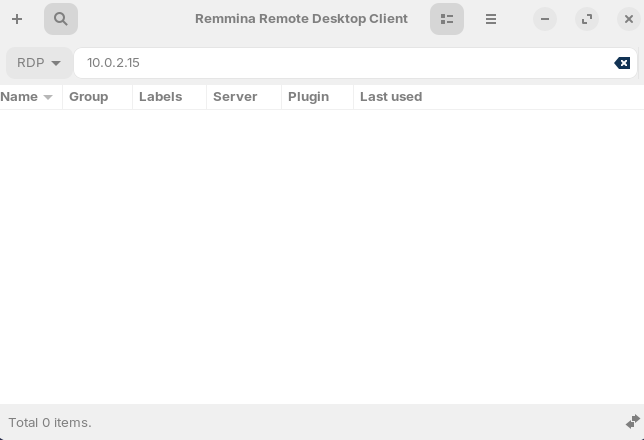

Posem la següent comanda a Windows per veure l’IP per això.

```
ipconfig
```

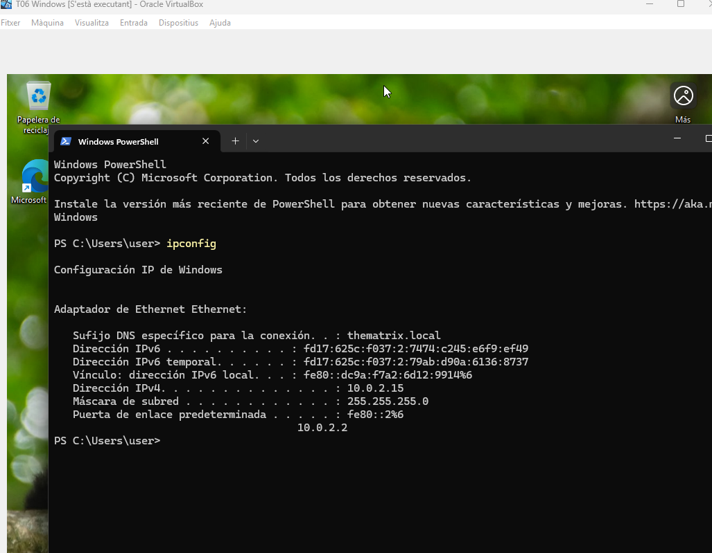

Ara Acceptem (Yes).


Posem l’username i el password per fer la connexió al Windows.

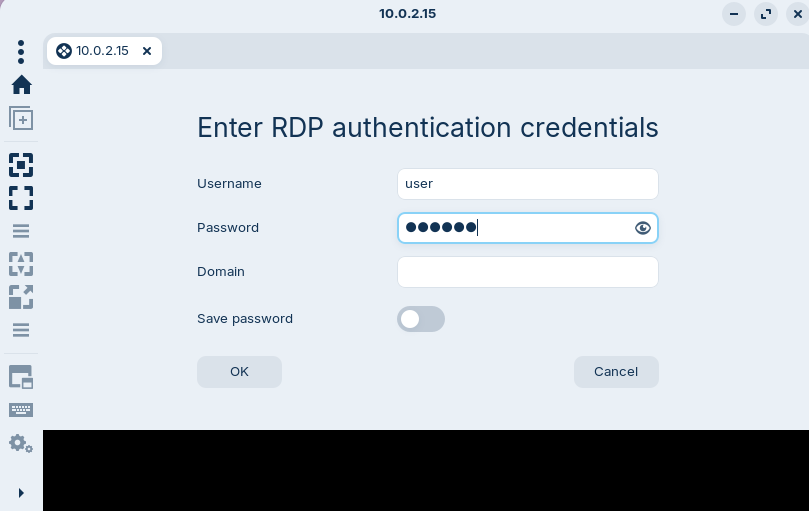

Ja estaria fet la connexió Zorin Windows.


Ara anem a Windows a connexió a Escriptori remot. Posem el nom de l’equip i connectem.

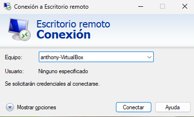

Posem el nom d’usuari i contrasenya corresponent i acceptem.

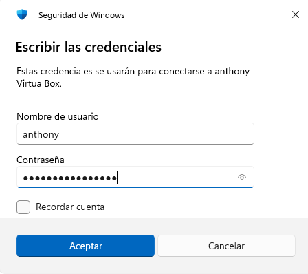

Diem que si.


Ja estaria fet la connexió Windows Zorin.

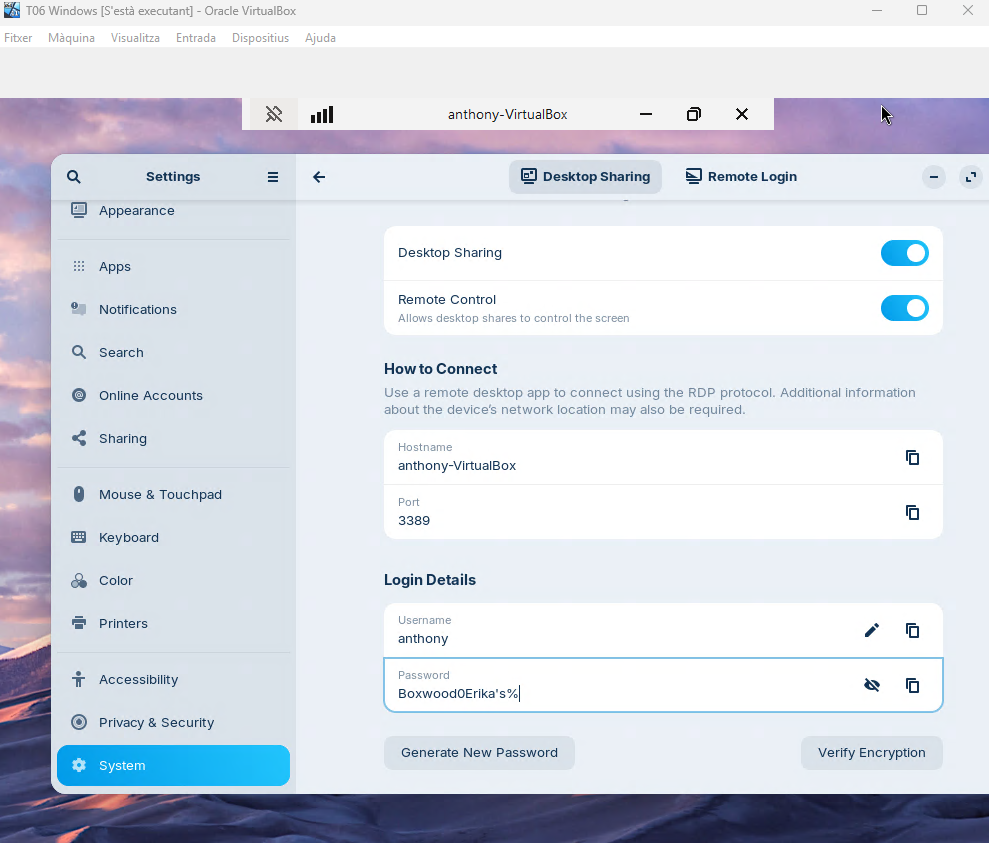


[Anar a l'enunciat](../Tasca06/README.md)  
[Anar a la pàgina inicial](../README.md)
