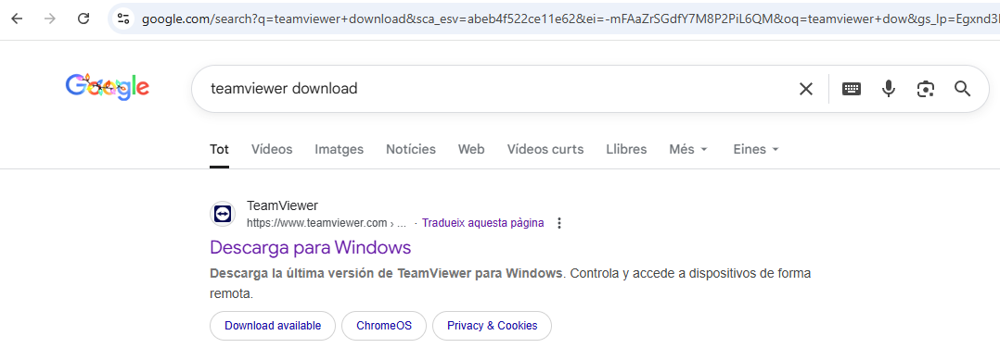
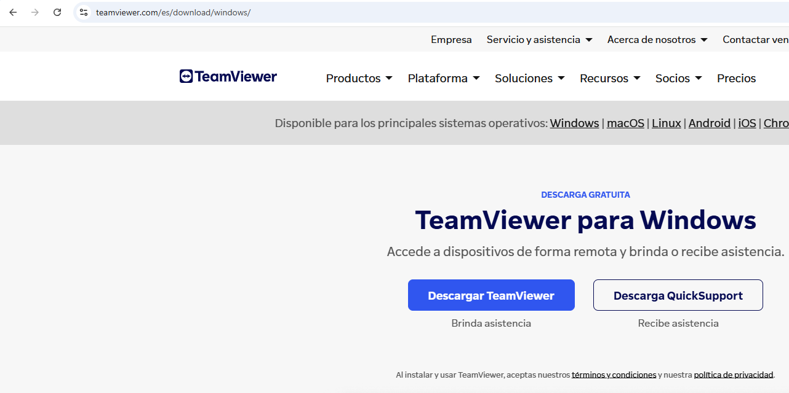
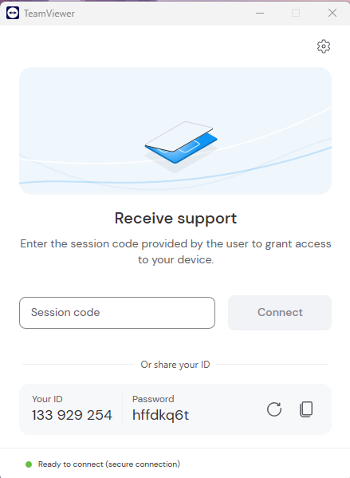
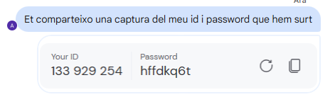
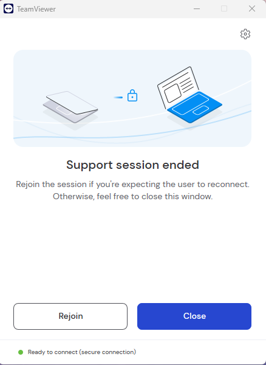
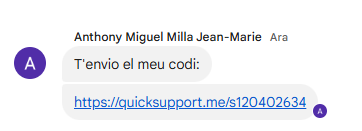
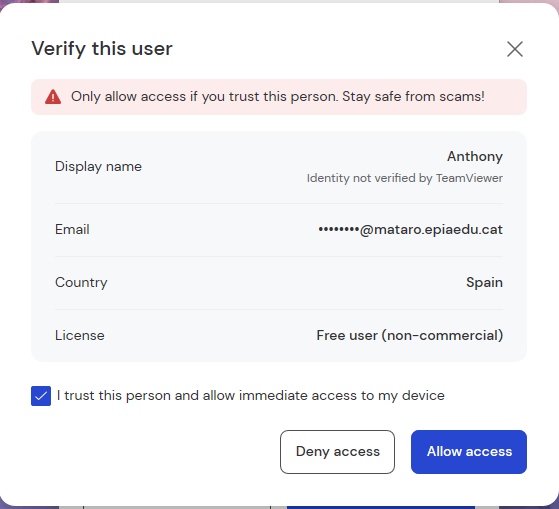
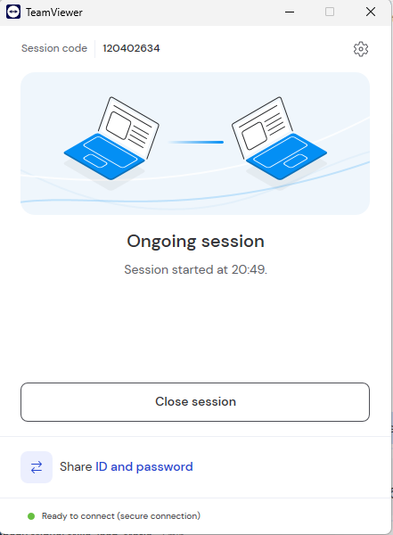
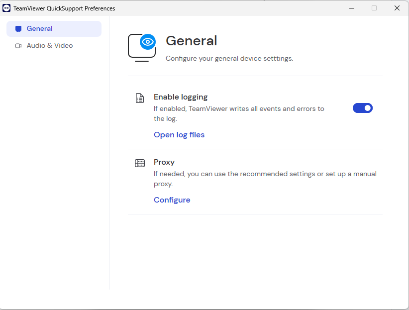
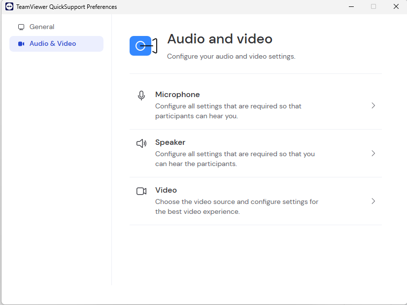

# Guia 2: Manual per al Client (Usuari Final)
Aquesta guia és la que enviarem als nostres clients quan tinguin una incidència. Ha de ser extremadament simple, visual i no tècnica.

Ha d'explicar el procés des del punt de vista de l'usuari que rep ajuda.

Ha d'incloure (amb captures de pantalla molt clares):

- L'enllaç o la manera de descarregar el mòdul "Quick Support" (o equivalent) que no requereixi instal·lació.
- On han de fer clic exactament.
- Com identificar i comunicar al tècnic l'ID de sessió i la contrasenya (si n'hi ha).
- Com acceptar la petició de connexió.

## GUIA
Eina: TeamViewer.

Primer de tot per poder fer la connexió remota haurem de baixar l’aplicació on mitjançant aquesta farem la connexió. Així que per descarregar-la, buscarem pel nostre buscador “TeamViewer download” i cliquem en el primer que ens surt, és a dir el mateix que surt a la imatge.

Ara dins de la web cliquem en el botó que posa “Descargar QuickSupport” perquè se'ns baixi. 
També pots accedir a la web mitjançant aquest enllaç de baix.
https://www.teamviewer.com/es/download/windows/?
Un cop descarregat ens sortirà que la descàrrega està feta en l'apartat de descàrregues del nostre navegador, un cop veiem que ja s'ha descarregat el cliquem per iniciar l’aplicació.

### Primera opció de connexió:
Un cop dins d’ella ens tindria que surtir aquesta paginà.

Seguidament per poder fer la connexió amb l'operador, haurem de passar-li una captura del nostre ID i de la password que ens surt. Són aquests dos apartats de la imatge (per cada persona hi ha un ID i password diferent).

Un cop l'operador ja hagi posat el que anteriorment li hem enviat ja li hauria de sortir la nostra pantalla en la seva, fent que la connexió remota hagi sigut un èxit. Molt ben fet 👍

Quan ja hagi acabat la connexió nosaltres ens assabentarem pel fet que ens sortirà aquest missatge de la imatge en pantalla, si no ens surt la connexió encara està activa.

### Segona opció de connexió:
Per la segona opció de connexió, primer de tot haurem de rebre un enllaç de l'operador per poder portar a terme la connexió remota. El cliquem.

Un cop clicat l’enllaç ens sortirà una pantalla emergent amb informació sobre l’operador, verifiquem que tota la informació que posa a la pantalla coincideix amb l'operador amb el qual volem fer la connexió. Un cop ja verificat marquem la casella “I trust this person and allow immediate acces to my device” que vol dir que confiem en l'operador i acceptem que tingui accés al nostre PC. Després de ja haver-ho marcat pitgem el botó “Allow acces” per començar la connexió remota.

Un cop fet ens sortirà una altra pantalla que ens verifica que s'ha començat la connexió, hi ha on en qualsevol moment si volem trencar la connexió li podrem donar a “Close session” per acabar la connexió. IMPORTANT NO TANCAR LA FINESTRA, LA PODEM MINIMITZAR PERÒ NO TANCAR.

També podrem verificar que és l’operador, ja que en l’apartat inferior dret de la pantalla ens sortirà l’operador que està en la connexió remota.

Finalment, en els dos tipus de connexions hi ha aquestes configuracions que ens podem servir entre altres a poder treure o afegir l'àudio o vídeo.

Un cop ja hàgim acabat podrem clicar a “Close session” per finalitzar la connexió remota.

