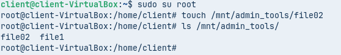
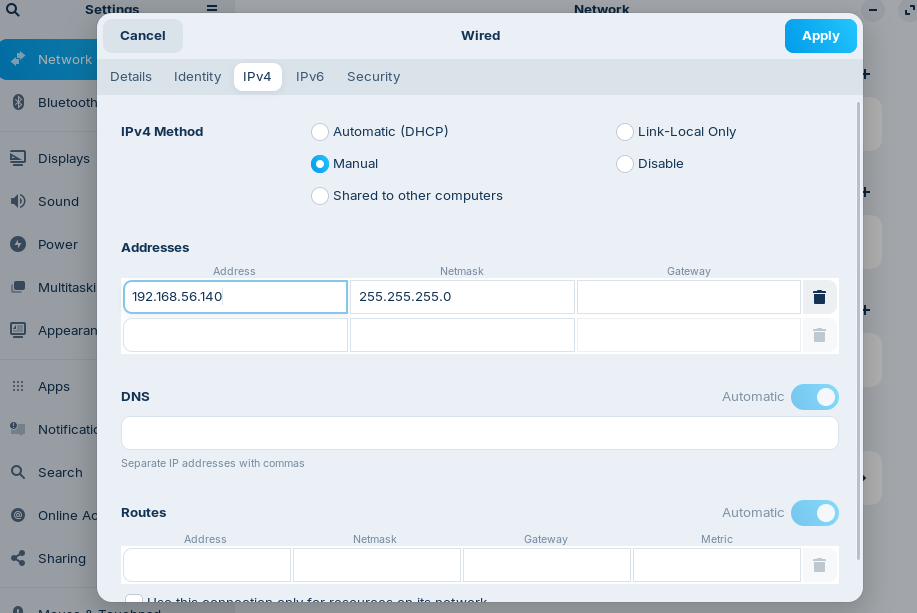
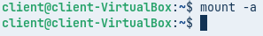
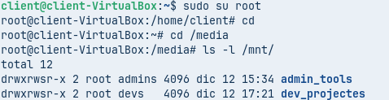

# SERVIDOR FITXERS LINUX. NFS

| Fase 1: Preparació de l’entorn |
|----------------------------------------|

Configurem els dos equips amb dues interfícies de xarxa: una NAT per a l'accés a Internet i una adaptador de xarxa només-amb-amfitrió per a la comunicació entre ells i potencialment, treballar via terminal SSH amb el servidor. 
Quan els instalem, posem espanyol (Espanya) d’idioma i amb l'idioma per defecte en espanyol. En Ubuntu Server, seleccionarem la instal·lació del servei SSH durant el procés d'instal·lació per facilitar la gestió remota.


Instal·lem el ssh per si de cas a les dues màquines, després fem ping per veure que ambdues màquines tinguin accés a Internet.

Per instalar ssh:
```
sudo apt install ssh
```


Després fem les actualitzacions.

```
sudo apt update && sudo apt upgrade
```


| Fase 2: Preparació del servidor |
|----------------------------------------|

Abans de compartir res, hem de preparar els usuaris i els directoris al Servidor.                        
Al zorin instal·lem Users and Groups per poder fer-ho, ja que de fabrica no deixa crear grups. I els creem corresponentment (Ubuntu).


Creació de Grups: Crear dos grups per al client: devs i admins.

```
sudo groupadd devs
```

```
sudo groupadd admins
```


Creació d'Usuaris: Crear un usuari dev01 (membre del grup devs).     
Crear un usuari admin01 (membre del grup admins).

```
sudo useradd dev01
```

```
sudo useradd -m admin01
```

```
sudo usermod -aG devs dev01
```

```
sudo usermod -aG admins admin01
```


Crear el directori per als projectes de desenvolupament (he posat projectes, perdó*): 
/srv/nfs/dev_projects
```
cd /srv
```

```
sudo mkdir /nfs
```

```
sudo mkdir /nfs/dev_projectes
```


Crear el directori per a les eines d'administració: 
/srv/nfs/admin_tools
```
cd /srv
```

```
sudo mkdir /nfs
```

```
sudo mkdir /nfs/admin_tools
```


Permisos del Servidor:

Es vol que els developers tinguin control total sobre els seus projectes.

Es vol que els administradors tinguin control sobre les seves eines.

En tots dos casos, l'usuari propietari serà root.

```
sudo chown root:devs /srv/nfs/dev_projectes
```

```
sudo chown root:admins /srv/nfs/admin_tools
```

```
sudo chmod 2775 /srv/nfs/dev_projectes
```

```
sudo chmod 2775 /srv/nfs/admin_tools
```

```
ls -l /srv/nfs/
```


Com a pas final, instal·lem els paquets necessaris per al servei NFS al servidor i es configurarà l'exportació dels directoris amb les opcions adequades.

```
sudo apt install nfs-kernel-server -y
```

```
systemctl status nfs-server
```


Configuració NFS.

```
sudo nano /etc/exports
```


Afegim la següent linea.

```
/srv/nfs *(rw,sync,no_subtree_check)
```


Fem restart.

```
sudo systemctl restart nfs-kernel-server
```


Després sudo exportfs -u

```
sudo exportfs -u
```


Ip a.

```
ip a
```


Fem sudo rpcinfo -p a l’IP (192.168.56.106).

```
sudo rpcinfo -p 192.168.56.106
```


Instal·lem nfs-common.

```
sudo apt install nfs-common -y
```


I ens connectem desde el client (Zorin) a l’Ubuntu.

```
sudo showmount -e 192.168.56.106
```


| Fase 3: L'Exportació d'Administració (El Dilema del root_squash) |
|----------------------------------------|

| Prova 1 (L'error comú) |
|----------------------------------------|

El client necessita que el directori /srv/nfs/admin_tools sigui accessible per l'equip d'administradors. A vegades, l'usuari root del client (que sou vosaltres, els consultors) necessitarà escriure en aquest directori per instal·lar eines. Aquí mostrarem un error típic i la seva solució. Anem a /etc/exports i posem/deixem la linea del final (que ja estava posada de la Fase 2), opcions ‘rw,sync’.

```
/srv/nfs *(rw,sync,no_subtree_check)
```


Des del client, muntar aquest recurs compartit a /mnt/admin_tools. Com a root del client, intentar crear un fitxer dins d'aquest directori muntat.

```
sudo mkdir /mnt/admin_tools
```

```
sudo mount -t nfs 192.168.56.106:/srv/nfs/admin_tools /mnt/admin_tools
```


Mnt.


No podem accedir al directori perquè el sistema ens rebutja l’entrada per manca d’autoritzacions. 


El motiu és que l’opció root_squash no està configurada, aleshores l’usuari de la màquina client no és reconegut com el mateix administrador del servidor Ubuntu.


Com a root no ens deixa crear-lo, però amb el admin si al tenir permisos, és l'error típic, el root del servidor i d'aquest (client) no és el mateix i aleshores per això falla.

```
sudo login admin01
```

```
cd /mnt/admin_tools/
```

```
touch file1
```

```
ls
```


Surt admin01 admins. En aquesta captura no surt correctament, però perquè és sàpiga.

```
ls -l /mnt/admin_tools
```


| Prova 2 (La Solució) |
|----------------------------------------|

Modificar l'exportació del directori /srv/nfs/admin_tools per incloure l'opció 'no_root_squash'. Per fer que el root del servidor i d'aquest (client) ara si sigui el mateix, i que sí, canvïi alguna cosa. 

```
sudo nano /etc/exports
```

Afegim/posem aquestes dues línies:

```
/srv/nfs/admin_tools *(rw,sync,no_subtree_check,no_root_squash)
```

```
/srv/nfs/dev_projectes *(rw,sync,no_subtree_check)
```

```
sudo systemctl restart nfs-kernel-server
```


Al client, desmuntar i tornar a muntar el recurs compartit.

```
sudo umount /mnt/admin_tools
```

```
sudo mount -t nfs 192.168.56.106:/srv/nfs/admin_tools /mnt/admin_tools
```


El root del servidor i d'aquest (client) ara si és el mateix i és soluciona.

```
sudo su root
```

```
touch /mnt/admin_tools/file02
```

```
ls /mnt/admin_tools/
```



Admin01 admins (que també aquí no surt correctament en aquesta captura).

```
ls -l /mnt/admin_tools
```


| Fase 4: L'Exportació de Desenvolupament (Permisos rw vs ro) |
|----------------------------------------|

Editar /etc/exports per afegir dues exportacions per al mateix directori. El client vol que la xarxa d'administració (p.ex., 192.168.56.0/24) hi pugui escriure, però que la xarxa de consultors (simularem que és una altra IP, p.ex., 192.168.56.100) només pugui llegir.

```
sudo nano /etc/exports
```

```
/srv/nfs/admin_tools *(rw,sync,no_subtree_check,no_root_squash)
```

```
/srv/nfs/dev_projectes 192.168.56.0/24(rw,sync,no_subtree_check)
```

```
/srv/nfs/dev_projectes 192.168.56.140(ro,sync,no_subtree_check)
```

```
sudo systemctl restart nfs-kernel-server
```


Des del client, muntar el recurs compartit a /mnt/dev_projects i provar d'escriure-hi com a usuari dev01. Hauria de funcionar.

```
sudo mkdir /mnt/dev_projectes
```


Anem a configuració, després anem a xarxa, Ethernet (enp0s8), ha d’estar connectat i bàsicament anem a IPv4 i podem fer-ho manual (Address, Netmask) amb una IP del rang, com podria ser 192.168.56.127 i Netmask què és 255.255.255.0, sinó podem fer-ho automàtic, Automatic (DHCP), la seleccionem i apply.          
Després:

```
sudo mount -t nfs 192.168.56.106:/srv/nfs/dev_projectes /mnt/dev_projectes
```

```
sudo mount 192.168.56.106:/srv/nfs/dev_projectes /mnt/dev_projectes
```


Entrem a dev01 amb login i creem l’arxiu correctament.

```
sudo login dev01
```

```
cd /mnt/dev_projectes
```

```
touch file03
```


Desmuntar el recurs i canviar manualment la IP del client a 192.168.56.100. Tornar a provar d'escriure al directori muntat com a usuari dev01 i comprovar que només funciona la lectura.            
Anem a configuració, després anem a xarxa, Ethernet (enp0s8), ha d’estar connectat i bàsicament anem a IPv4 i hi posem en Address i Netmask IP (192.168.56.140) i Netmask que és 255.255.255.0.


Tornem a provar d'escriure al directori muntat com a usuari dev01 i només funciona la lectura, no es pot crear en aquest cas.

```
sudo su root
```

```
cd /mnt/dev_projectes
```

```
touch file04
```



Ara canviem d'usuari al client a admin01 i tornem a provar d'escriure al directori muntat i no es pot escriure, ja que admin01 no és membre del grup devs (permisos locals del sistema de fitxers). Aquí vaig tenir un error de permisos i posa permís denegat, realment surt, ha de sortir, que no es pot escriure.

```
sudo login admin01
```

```
touch /mnt/dev_projectes/file05
```


| Fase 5: Muntatge Automàtic amb /etc/fstab |
|----------------------------------------|

És evident que els usuaris no poden estar muntant manualment els recursos compartits cada vegada que reinicien el sistema. Per això, es configurarà el muntatge automàtic mitjançant el fitxer /etc/fstab al client.
Editar el fitxer /etc/fstab al client per afegir les entrades necessàries per muntar automàticament els recursos compartits NFS al directori /mnt/admin_tools i /mnt/dev_projects durant l'inici del sistema.

```
sudo nano /etc/fstab
```


Posem les dues següents línies:

```
192.168.56.106:/srv/nfs/admin_tools /mnt/admin_tools nfs defaults 0 0
```

```
192.168.56.106:/srv/nfs/dev_projectes /mnt/dev_projectes nfs defaults 0 0
```


Executar la comanda mount -a per provar les entrades sense reiniciar.

```
mount -a
```



També es pot fer aixís, Màquina i Reinicia.


Reiniciar el client i verificar que els recursos compartits s'han muntat correctament.

```
sudo su root
```

```
cd
```

```
cd /media
```

```
ls -l /mnt/
```




| Conclusió |
|----------------------------------------|

**En aquesta prova de concepte s'ha demostrat el funcionament amb els requisits que ha demanat l'empresa client, però ja ets un tècnic prou experimentat per saber que aquesta solució té moltes limitacions i problemes de seguretat. Quines recomanacions faries al client per millorar aquesta solució en un futur? Pensa en termes d'autenticació centralitzada i gestió d'usuaris i permisos.**

Aquesta prova de concepte està bé, però aquest sistema així tal qual no serviria si algun dia doncs es vol ampliar. Aquesta solució té moltes limitacions i problemes de seguretat. Jo de recomanacions que faria al client per millorar aquesta solució en un futur seria organitzar millor els permisos, que no depenguin de cada equip, després una altra recomenació sería centralitzar els usuaris i grups amb un servei com LDAP, també es podrien usar altres serveis que hi han com Kerberos, Active Directory o FreeIPA, que són molt útils ja que tosts aquests permeten tenir els usuaris i permisos centralitzats i doncs molt més controlats i una altra recomanació unificar la gestió dels permisos des del servidor, així tot queda més controlat i no hi ha diferències entre equips.

[Anar a l'enunciat](../Tasca09/README.md)  
[Anar a la pàgina inicial](../README.md)
