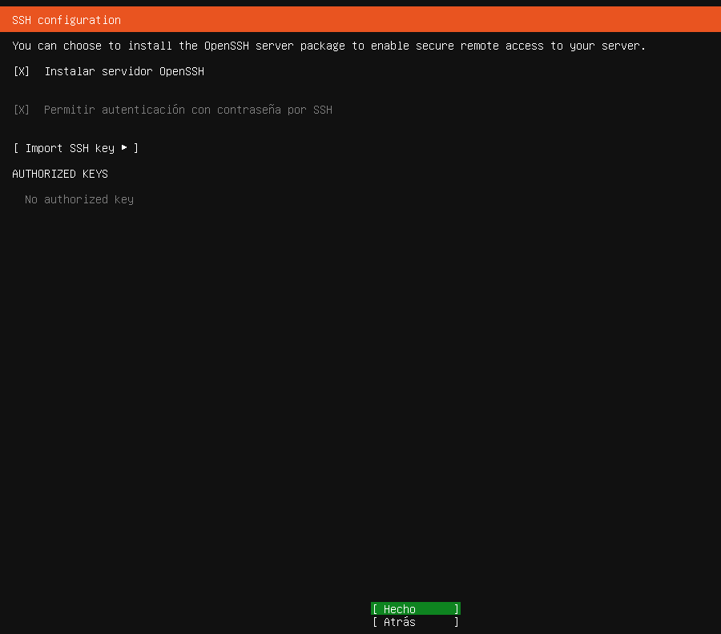

# SERVIDOR FITXERS LINUX. NFS

| Fase 1: Preparació de l’entorn |
|----------------------------------------|

Configurem els dos equips amb dues interfícies de xarxa: una NAT per a l'accés a Internet i una adaptador de xarxa només-amb-amfitrió per a la comunicació entre ells i potencialment, treballar via terminal SSH amb el servidor. 
Quan els instalem, posem espanyol (Espanya) d’idioma i amb l'idioma per defecte en espanyol. En Ubuntu Server, seleccionarem la instal·lació del servei SSH durant el procés d'instal·lació per facilitar la gestió remota.

[Anar a l'enunciat](../Tasca09/README.md)  
[Anar a la pàgina inicial](../README.md)
