# SERVIDOR FITXERS LINUX. NFS

| Fase 1: Preparació de l’entorn |
|----------------------------------------|

Configurem els dos equips amb dues interfícies de xarxa: una NAT per a l'accés a Internet i una adaptador de xarxa només-amb-amfitrió per a la comunicació entre ells i potencialment, treballar via terminal SSH amb el servidor. 
Quan els instalem, posem espanyol (Espanya) d’idioma i amb l'idioma per defecte en espanyol. En Ubuntu Server, seleccionarem la instal·lació del servei SSH durant el procés d'instal·lació per facilitar la gestió remota.


Instal·lem el ssh per si de cas a les dues màquines, després fem ping per veure que ambdues màquines tinguin accés a Internet.

Per instalar ssh:
```
sudo apt install ssh
```

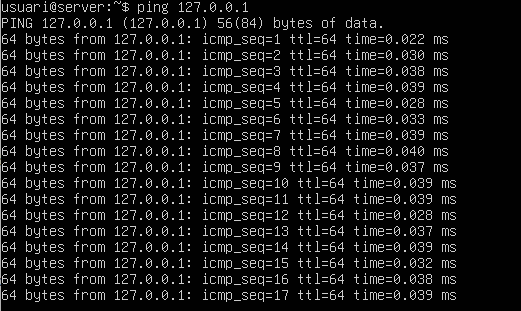

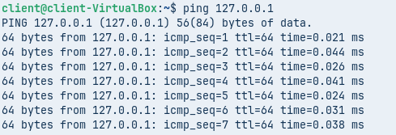

Després fem les actualitzacions.

```
sudo apt update && sudo apt upgrade
```


| Fase 2: Preparació del servidor |
|----------------------------------------|

Abans de compartir res, hem de preparar els usuaris i els directoris al Servidor.                        
Al zorin instal·lem Users and Groups per poder fer-ho, ja que de fabrica no deixa crear grups. I els creem (Ubuntu).

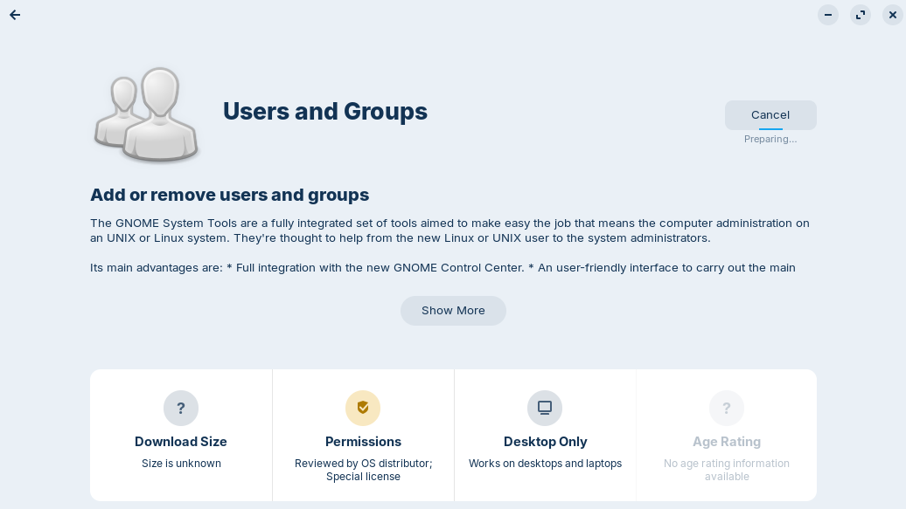

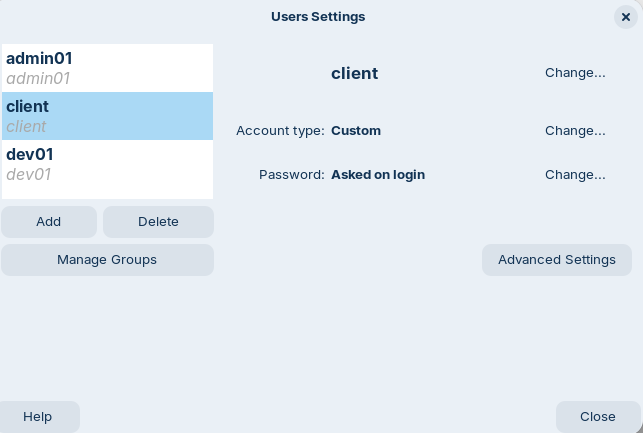

Creació de Grups: Crear dos grups per al client: devs i admins.


Creació d'Usuaris: Crear un usuari dev01 (membre del grup devs).     
Crear un usuari admin01 (membre del grup admins).


Crear el directori per als projectes de desenvolupament: 
/srv/nfs/dev_projects
```
cd /srv
```

```
sudo mkdir /nfs
```

```
sudo mkdir /nfs/dev_projectes
```


Crear el directori per a les eines d'administració: 
/srv/nfs/admin_tools
```
sudo su
```

```
sudo mkdir /srv/nfs/admin_tools
```


Permisos del Servidor:

Es vol que els developers tinguin control total sobre els seus projectes.

Es vol que els administradors tinguin control sobre les seves eines.

En tots dos casos, l'usuari propietari serà root.

```
cd /nfs
```

```
sudo chown root:devs dev_projectes
```

```
sudo chown root:admins admin_tools
```

```
sudo chmod 770 dev_projectes
```

```
sudo chmod 770 admin_tools
```

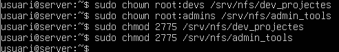

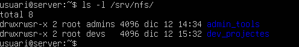

Com a pas final, instal·lem els paquets necessaris per al servei NFS al servidor i es configurarà l'exportació dels directoris amb les opcions adequades.

```
sudo apt install nfs-kernel-server -y
```

```
systemctl status nfs-server
```


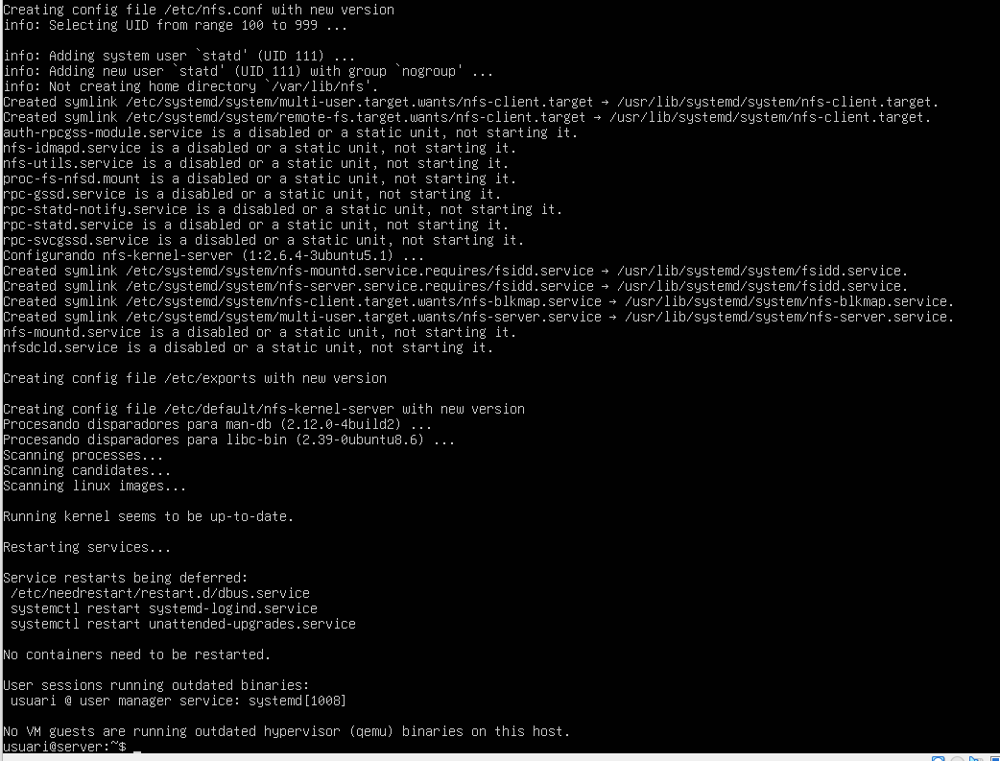


Configuració NFS.

```
sudo nano /etc/exports
```

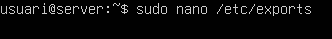

Afegim la següent linea.


Fem restart.

```
sudo systemctl restart nfs-kernel-server
```


Després sudo exportfs -u

```
sudo exportfs -u
```


Ip a.

```
ip a
```

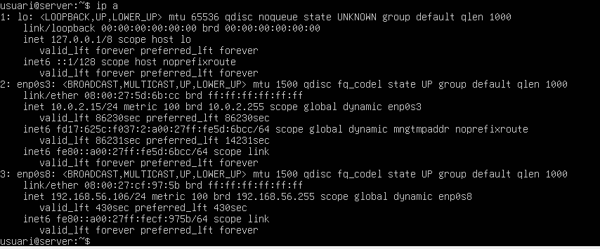

Fem sudo rpcinfo -p a l’IP (192.168.56.106).

```
sudo rpcinfo -p 192.168.56.106
```

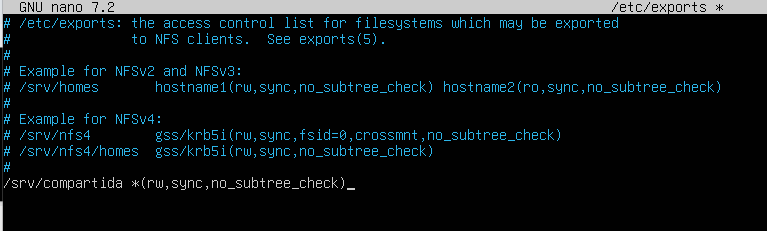

Instal·lem nfs-common.


I ens connectem desde el client (Zorin) a l’Ubuntu.


| Fase 3: L'Exportació d'Administració (El Dilema del root_squash) |
|----------------------------------------|

El client necessita que el directori /srv/nfs/admin_tools sigui accessible per l'equip d'administradors. A vegades, l'usuari root del client (que sou vosaltres, els consultors) necessitarà escriure en aquest directori per instal·lar eines. Aquí mostrarem un error típic i la seva solució. Anem a /etc/exports i posem/deixem la linea del final (que ja estava posada de la Fase 2).


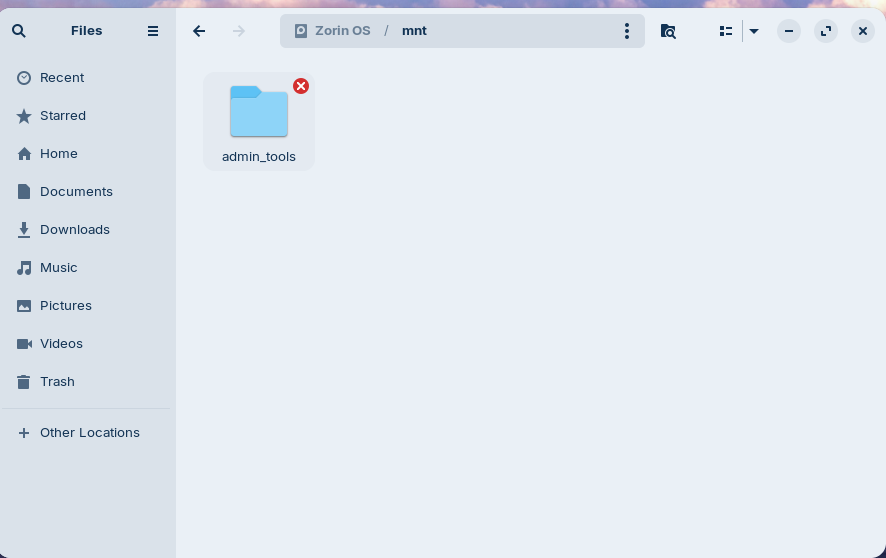

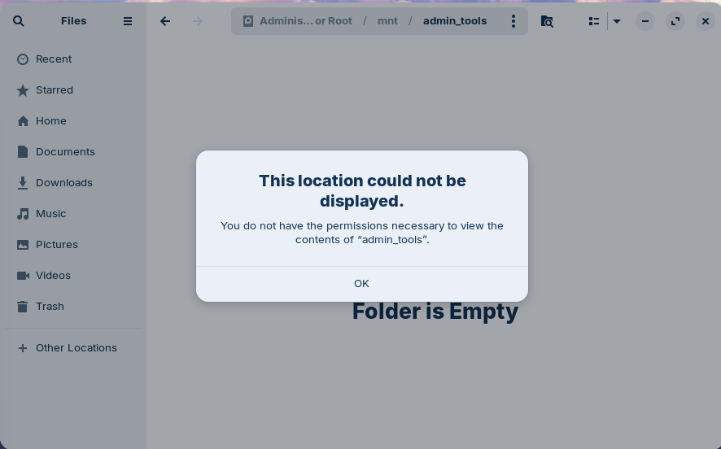

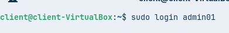

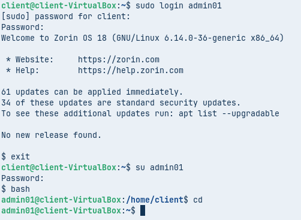

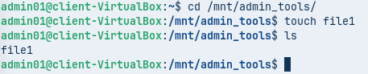


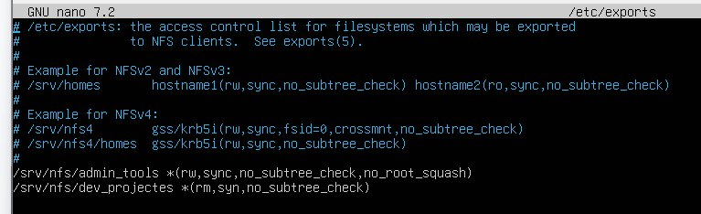


[Anar a l'enunciat](../Tasca09/README.md)  
[Anar a la pàgina inicial](../README.md)
